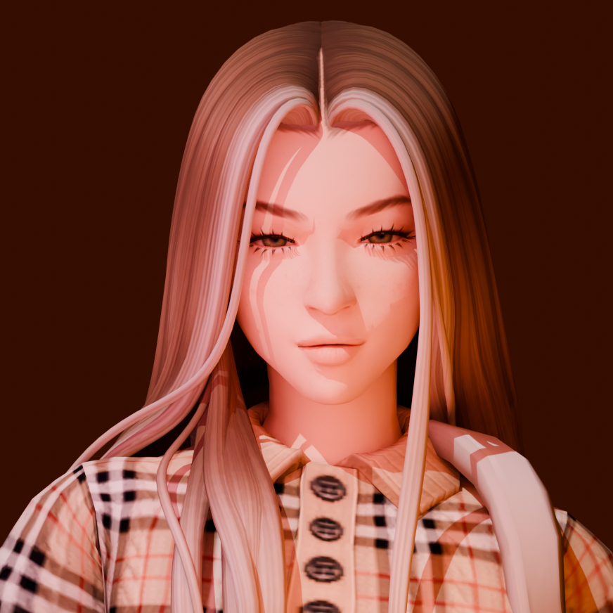
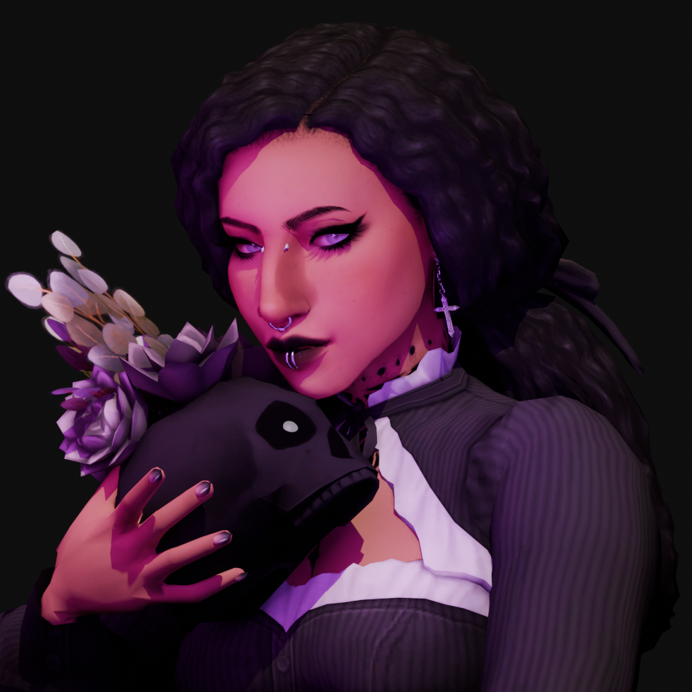
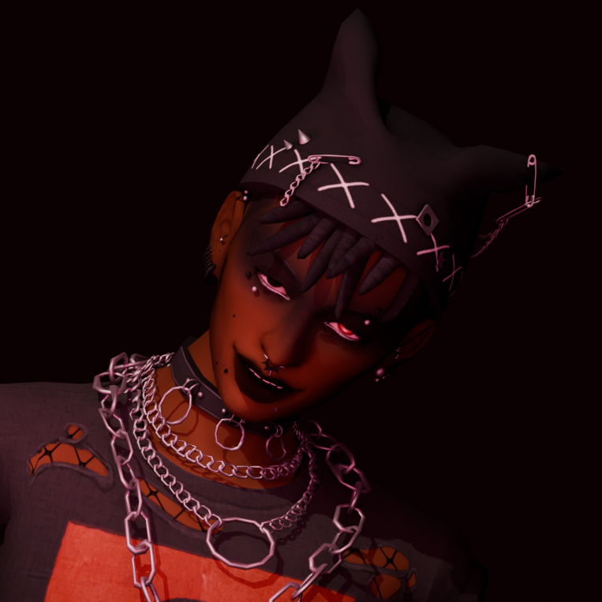

# Characters
## Malachi

A highschool anthropology teacher who has gotten sucked in to the world of conspiracy after he was in a near deadly motorcycle accident. He keeps his crack pot ideas outta the lesson plan, so he doesn't get fired, so he subjects his quite literal insanity on his friends. He and Taelili don't see eye to eye on the occult, but they put their differences aside for Spider, Malachi's girlfriend and Taelili's best friend. 
He doesn't believe that the aliens built the pyramids, but he *does* believe that the citizens of Atlantis achieved enlightenment, and rose into space as gods, and are now traveling the stars. His ass is not taking his happy pills.
Is able to move objects telekinetically, and summon them from his own liminal space.
```md unfold file:Playlist
Peer Gynt, Op. 23: IV. In the Hall of the Mountain King - Philharmonia Orchestra
Amnesia Was Her Name - Lemon Demon
Little Talks - Of Mice and Men
Joker and the Thief - Wolfmother
```

```palette
#303a31
#50332b
#994d41
#b69280
```
---
## Spider(lily)

A fun-loving spunky empath, that's fallen into a really weird crowd. Malachi's girlfriend and Lili's best friend.
```md unfold file:Playlist
Stargirl Interlude - The Weekend, Lana Del Ray
Burn Your Village - Kiki Rockwell
The Woman I Am - AURORA
The Blade - AURORA
Oscillating in Imaginary Butterflies - Matahara
```

```palette
#340c04
#bf512d
#d99588
#bcd988
```
---
## Taelili

 An occultist, that fucked around and found out, and now her soul  wanders through the different planes. Her friends take turns watching her body and making sure she's safe in the real world. If the desperately need her attention? Summoning ritual!
Spider is her primary caretaker and roommate. And although they have drastically different styles, Spider makes an effort to dress up her body in clothing she would adore.
```md unfold file:Playlist
Constellations - The Oh Hellos
From Persephone  - Kiki Rockwell
Ocean Eyes - Bille Eilish , Astronomyy
4:00 AM - Taeko Onuki
This Will End - The Oh Hellos
```

```palette
#1a0e1e
#793893
#b45b7c
#d0b7d4
```
---
## Grunge

A goth who fucked around a found out. Shifts in and out of a ghost form at will. Incredibly attracted to Taelili.
```md unfold file:Playlist
American Beauty/American Psycho - Fall Out Boy
Chicken Huntin' - Insane Clown Posse
EXORCIST - KXLLSWXTCH
Wire - WorthiKids
Shaush - Biskwiq
```

```palette
#0b0404
#581b12
#a23025
#cda0a6
```
---
## Oliver
The "i know a guy". Genderfluid, but he doesn't know that yet.
```md unfold file:Playlist
Big Poppa - The Notorious B.I.G.
CBAT - Hudson Mohawke
WHAT DO U LIKE - Tommy Richman
MILLION DOLLAR BABY - Tommy Richman
King K Rool - Belak
Sparkle - Kid Bloom
burbank house - tsubi club
```
---