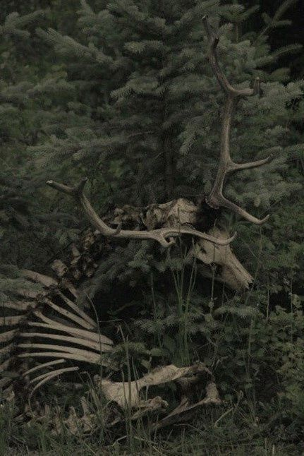

---
tags:
  - Stage
Home:
  - "[[Dream Journal Home Page]]"
cssclasses:
  - code
---
> [!infobox ]+   Court of Death and Desire
> 
> ```palette
> #1C1C2C, #F3ACD0, #FFF, #F79782, #F7CA82, #DEE9A5, #A5E9B0, #A4D7E5, #D2A5E9
> ```
> ```css
> /* Colors */
> --background-color: 28, 28, 44;
> --background-highlight: 32, 35, 53;
> --primary-color: 243, 172, 208;
> --text: 255, 255, 255;
> /* Tints */
> --primary-tint:  243, 172, 208;
> --secondary-tint: 165, 214, 230;
> --tertiary-tint: 213, 168, 233;
> --yellow-tint: 222, 233, 165;
> /* Fonts */
> font-family: "Dosis", sans-serif;
>```

> [!infobox ]+ Milo & Caspian

> ```palette
> #211D1D, #D18A98, #CCC3C5, #a6bdee, #8B7298
> ```
>```css
> /* Colors */
> --background-color: 33, 29, 29;
> --background-highlight: 209, 138, 152, .1;
> --primary-color: 209, 138, 152;
> --text: 204, 195, 197;
> /* Tints */
> --primary-tint: 209, 138, 152;
> --secondary-tint: 166, 189, 238;
> --tertiary-tint: 139, 114, 152;
> /* Fonts */
> font-family: "Rokkitt", serif;
>```

>[!infobox]+ Of Gods and Fiends
>
> ```palette
> #15071D, #FFE6D7, #B93349, #609FE6, #E5248E
> ```
>```css
> /* Colors */
> --background-color: 21, 7, 29;
> --background-highlight: 185, 51, 73, .1;
> --primary-color: 185, 51, 73;
> --text: 255, 230, 215;
> /* Tints */
> --primary-tint: 185, 51, 73;
> --secondary-tint: 229, 36, 142;
> --tertiary-tint: 96, 159, 230;
> /* Fonts */
> font-family: "Barlow", sans-serif;
>```

>[!infobox]+ Nothing Left to Say
>
>```palette
> #120E0B, #8f8675, #c7c3ba,  #515846  , #3e4a4d, #68664d
> ```
>```css
> /* Colors */
> --background-color: 18, 14, 11;
> --background-highlight: 143, 134, 117, .1;
> --primary-color: 143, 134, 117;
> --text: 199, 195, 186;
> /* Tints */
> --primary-tint: 143 , 134, 117;
> --secondary-tint: 62, 74, 77;
> --tertiary-tint:  81, 88, 70;
> /* Fonts */
> font-family: "Barlow", sans-serif;
>```

>[!infobox]+ Atomize
>
>```palette
>  #120E0B, #DDF4F1,  #0d526e , #ca5858, #ca8a58
> ```
>```css
> /* Colors */
--background-color: 6,26,36;
--text: 221,244,241;
/* Tints */
--primary-tint: 13,82,110;
--secondary-tint: 202,88,88;
--tertiary-tint:  202, 138, 88;
/* Fonts */
font-family: "Barlow", sans-serif;
>```