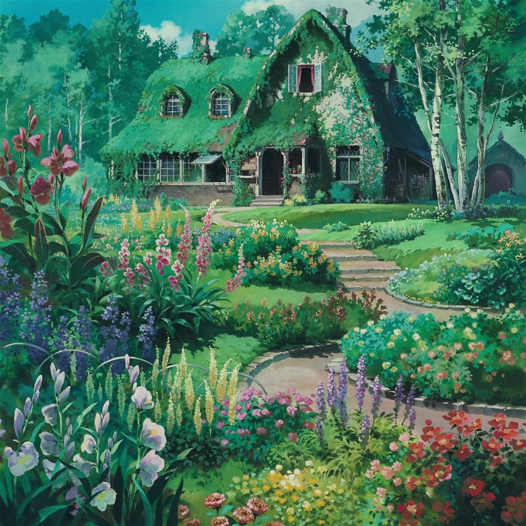

---
tags:
  - Stage
Home:
  - "[[Dream Journal Home Page]]"
cssclasses:
  - code
---
> [!infobox ]+   Court of Death and Desire
> 
> ```palette
> #1C1C2C, #F3ACD0, #FFF, #F79782, #F7CA82, #DEE9A5, #A5E9B0, #A4D7E5, #D2A5E9
> ```
> ```css
> --background-color: 28, 28, 44;
> --primary-color: 243, 172, 208;
> --text: 255, 255, 255;
>
> --red-tint: 247, 151, 130;
> --orange-tint: 247, 202, 130;
> --yellow-tint: 222, 233, 165;
> --green-tint: 165, 233, 176;
> --blue-tint: 165, 214, 230;
> --purple-tint: 213, 168, 233;
>
> font-family: "Dosis", sans-serif;
>```


> [!infobox ]+  Fantasy Steampunk Mermaids

>```css
> --background-color: 51, 41, 27;
> --primary-color: 226, 183, 113;
> --text: 248, 244, 215;
>
> --red-tint: 189, 101, 53;
> --orange-tint: 203, 155, 79;
> --yellow-tint: 235, 238, 136;
> --green-tint: 161, 182, 94;
> --blue-tint: 179, 246, 229;
> --purple-tint: 220, 156, 172;
>
> font-family: "Rokkitt", serif;
>```


>[!infobox]+ Of Gods and Fiends
>
> ```palette
> #15071D, #FFE6D7, #B93349, #609FE6, #E5248E
> ```
>```css
> --background-color: 21, 7, 29;
> --primary-color: 185, 51, 73;
> --text: 255, 230, 215;
>
> --red-tint: 185, 51, 73;
> --blue-tint: 96, 159, 230;
> --purple-tint: 229, 36, 142;
>
> font-family: "Barlow", sans-serif;
>```

>[!infobox]+ Nothing Left to Say
>
>```palette
> #120E0B, #8f8675, #c7c3ba,  #515846 , #3e4a4d, #68664d
> ```
>```css
> --background-color: 18, 14, 11;
> --primary-color: 143 , 134, 117;
>
> --yellow-tint: 153, 149, 107;
> --green-tint: 81, 88, 70;
> --blue-tint: 62, 74, 77;
>
> --text: 199, 195, 186;
>
> font-family: "Rokkitt", serif;
>```
