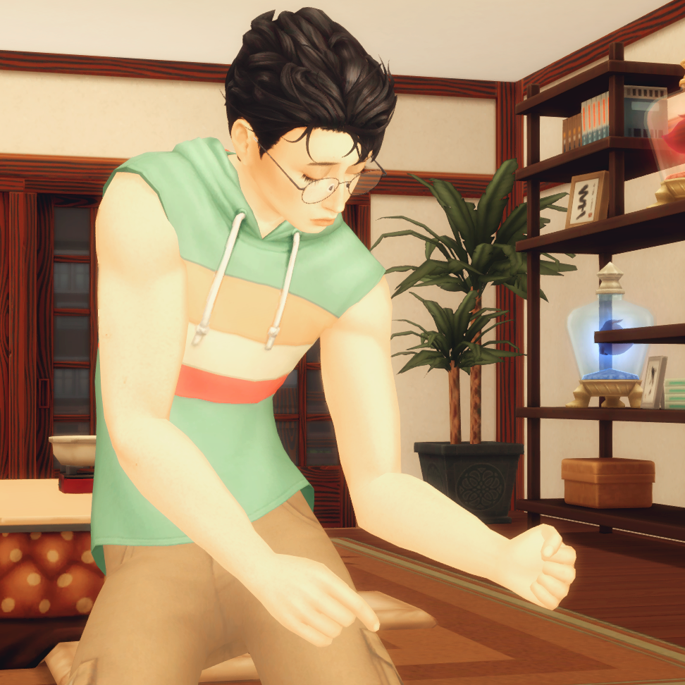

--- start-multi-column: ID_n9io
```column-settings
Border: disabled
Number of Columns: 2
Largest Column: standard
```

Ken Takakura (Okarun) was bitten as a teenager by a vampire during a dare between him and his now girlfriend [Momo Ayase](Momo%20Ayase.md). Since then, he has become a Daywalker, a vampire that's able to go around in the daylight. He only drinks from plasma packs created from frogs and from Momo.

Currently Okarun works as an Assistant in [science center]. He's fascinated by space and aliens, and his dream is to discover alien life and travel the stars. He's incredibly smart, but is struggling to get recognized at work. Due to this, he struggles with burnout and feelings of worthlessness. 

At home, he does most of the cooking and the cleaning as a stress reliever. He spends most of his time in his office/workshop tinkering with his robots. While he's new to the hobby, he's enjoying himself no matter how many injuries he ends up with.

--- column-break ---



--- end-multi-column
