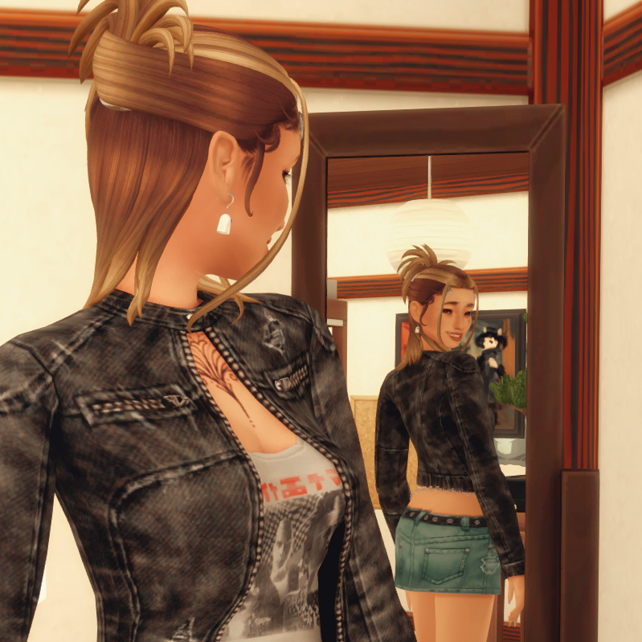

--- start-multi-column: ID_frik
```column-settings
Number of Columns: 5
Text Align: Center
Col Width: 20%
Border: disabled
Shadow: disabled
```


--- column-break ---


--- column-break ---


--- column-break ---


--- column-break ---


--- end-multi-column


--- start-multi-column: ID_n9io
```column-settings
Border: disabled
Shadow: disabled
Number of Columns: 2
Largest Column: standard
```

Momo Ayase developed telekinetic powers on accident during a dare between her and her now boyfriend [Ken Takakura](Ken%20Takakura.md). Since then, she's been able to see ghosts and works as a Medium. She's recently got into tarot reading, and is looking to craft her own deck. Most of her current gigs require being up very late at night, so recently she and Okarun have not been able to spend as much time together as she would like.

Ever since she was raised child she's been fascinated by death. And now after unlocking her supernatural abilities, she wants to become a Medium that her grandmother would be proud of. Her best and only friend [Jenna Akiyama](Jenna%20Akiyama.md), while skeptical of tarot, is her willing Guinea pig.

Besides working as a Medium, Momo can be often found at the library, researching death records. She also enjoys knitting and crocheting for friends.

--- column-break ---




--- end-multi-column