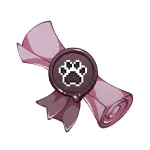
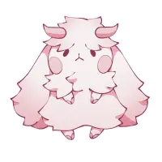
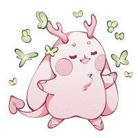

--- start-multi-column: ExampleRegion1  
```column-settings  
number of columns:3  
largest column: center 
Alignment: [Center, Left, Center]
border: off
shadow: off
```

      
 
 

--- end-column ---

---
### Relationships
[Sephtis](Sephtis.md): supposed to be my best friend, but he's hiding stuff from me and i dont like it >:c
[Jengu](Jengu.md):  my asshole brother /aff
[Achara](Achara.md): *blush intensifies*

---
### Likes
- causing problems
- his cave
- being dramatic
- drinking coffee to forget
### Dislikes
- not getting his way
- hurting his loved ones
---
### Notes:
- One very demonic looking angel (he doesnt have a complex about it) *(not cannon on the site)*
- One of the most dramatic people you will ever meet.
- lives in a cave like a loser *(he's anti-social)*
---
### plot
- had a mental breakdown and ran away from angelburg or whatever the fuck its called, ended up in a cave near burrowgatory
- meets bastet on a supply run into the city, tries to be evil and fails. acquired best friend
- together they hunt dont and murder her past abuser, they now have a little under the table business for it

--- end-column ---








--- end-multi-column