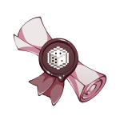
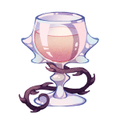
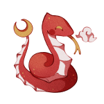
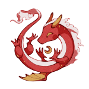
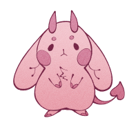
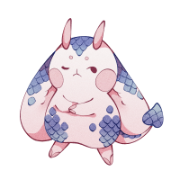
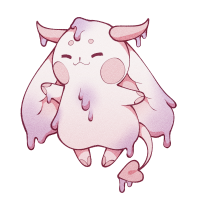

--- start-multi-column: ExampleRegion1  
```column-settings  
number of columns:3  
largest column: center 
Alignment: [Center, Left, Center]
border: off
shadow: off
```

     
 
  

--- end-column ---

### Relationships
[Sephtis](Sephtis.md): my worst fucking nightmare
[Bastet](Bastet.md): i should've protected her better
[Achara](Achara.md):  ...

---
### Likes
- wealth and power
- gambling
- a good stiff liqour
### Dislikes
- being told no
- sephtis
---
### Plot
- comes home one day and bastet has invited over the most insufferable man in the universe home. at least she isnt dating this one.
- OPPS SOMEHOW MY DICKS FELL INTO HIM????? BUT IM STRAIGHT???????????????????
- he's good at taking out the "trash"
---
### Notes
- friendly and personable, but doesnt form deep relationships
- uses people and they love him for it

--- end-column ---









--- end-multi-column