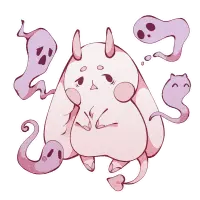
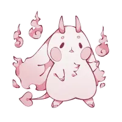
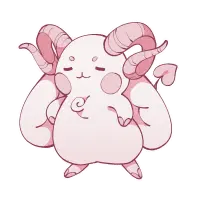

---
Multi-Column Markdown:
  - Number of columns: 3
  - Alignment: [Center, Left, Center]
  - Border: off
---
### Likes
- Causing Problems
- Protecting his loved ones
- being dramatic
### Dislikes
- not getting his way
- hurting his loved ones
---
### Notes:
- One very demonic looking angel (he doesnt have a complex about it)
- One of the most dramatic people you will ever meet.
- lives in a cave like a loser (he's anti-social)
---
### Ideas
- had a mental breakdown and ran away from angelburg or whatever the fuck its called, ended up in a cave

--- start-multi-column: ExampleRegion1  

   
  
  
   

--- end-column ---

**Age:** ∞
**Gender:** ???? 
**Sexuality:** Gay
**Species**: Cherubun
[Bastet](Bastet.md): My best friend that needs to stand up for herself better.
[Jengu](Jengu.md):  "Are you saying your heart burns for me?"  "...In like a super negative way."
[Achara](Achara.md): The very sweet woman **Bastet** is crushing on.

--- end-column ---

--- end-multi-column