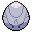
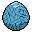

---
cssclasses:
  - pokemon
---

```yaml enhanced-tables
yes-format: "1" 
no-format: "0"
columns:
  Collected:
    type: bool
  Evolving:
    type: bool
  Held Item:
    type: bool
filter: Boolean($row.Collected) > -1
filters:
    Evolving: Boolean($row.Evolving) > 0
pagination:
  page-size: 8
  page-sizes:
   - 8
# hide-controls: false
hide-configuration: true
```

| Region | Pokedex | Pokemon                                  | Pokedex Entry                                        | Egg                                          | Type A   | Type B | Best Field         | Collected | Evolving | Status                                                |
| ------ | ------- | ---------------------------------------- | ---------------------------------------------------- | -------------------------------------------- | -------- | ------ | ------------------ | --------- | -------- | ----------------------------------------------------- |
| Kanto  | 0037    |        | [Vulpix](https://pokemondb.net/pokedex/vulpix)       |        | Fire     | -      | Fire               | 1         | 0        |        |
| Kanto  | 0038    |  | [Ninetales](https://pokemondb.net/pokedex/ninetales) |        | Fire     | -      | Fire               | 1         | 0        |  |
| Kanto  | 0059    |    | [Arcanine](https://pokemondb.net/pokedex/arcanine)   |  | Fire     | -      | Fire               | 1         | 0        |  |
| Kanto  | 0078    |        | [Ponyta](https://pokemondb.net/pokedex/ponyta)       |        | Fire     | -      | Fire               | 1         | 0        |        |
| Kanto  | 0079    |    | [Rapidash](https://pokemondb.net/pokedex/rapidash)   |        | Fire     | -      | Fire               | 1         | 0        |    |
| Kanto  | 0092    |        | [Gastly](https://pokemondb.net/pokedex/gastly)       |                  | Ghost    | Poison | Ghost              | 1         | 0        |        |
| Kanto  | 0093    |             | [Haunter](https://pokemondb.net/pokedex/haunter)     |                  | Ghost    | Poison | Ghost              | 1         | 0        |      |
| Kanto  | 0111    |           | [Rhyhorn](https://pokemondb.net/pokedex/rhyhorn)     |                          | Ground   | Rock   | Water/Grass/Ground | 1         | 0        |      |
| Kanto  | 0114    |             | [Tangela](https://pokemondb.net/pokedex/tangela)     |                          | Grass    | -      | Grass              | 1         | 0        |                                                       |
| Kanto  | 0129    |            | [Magikarp](https://pokemondb.net/pokedex/magikarp)   |                         | Water    | -      | Water              | 1         | 0        |                                                       |
| Kanto  | 0132    |               | [Ditto](https://pokemondb.net/pokedex/ditto)         |                            | Normal   | -      | Normal             | 0         | 0        |                                                       |
| Kanto  | 0133    |           | [Eevee](https://pokemondb.net/pokedex/eevee)         |                            | Normal   | -      | Normal             | 0         | 0        |                                                       |
| Kanto  | 0135    |         | [Jolteon](https://pokemondb.net/pokedex/jolteon)     |                            | Electric | -      | Electric           | 0         | 1        |                                                       |
| Kanto  | 0136    |             | [Flareon](https://pokemondb.net/pokedex/flareon)     |                            | Fire     | -      | Fire               | 0         | 0        |                                                       |
| Kanto  | 0143    |             | [Snorlax](https://pokemondb.net/pokedex/snorlax)     |                          | Normal   | -      | Normal             | 1         | 0        |                                                       |
| Kanto  | 0147    |             | [Dratini](https://pokemondb.net/pokedex/dratini)     |                          | Dragon   | -      | Dragon             | 1         | 0        |                                                       |
| Kanto  | 0151    |                 | [Mew](https://pokemondb.net/pokedex/mew)             |                              | Psychic  | -      | Psychic            | 0         | 0        |                                                       |