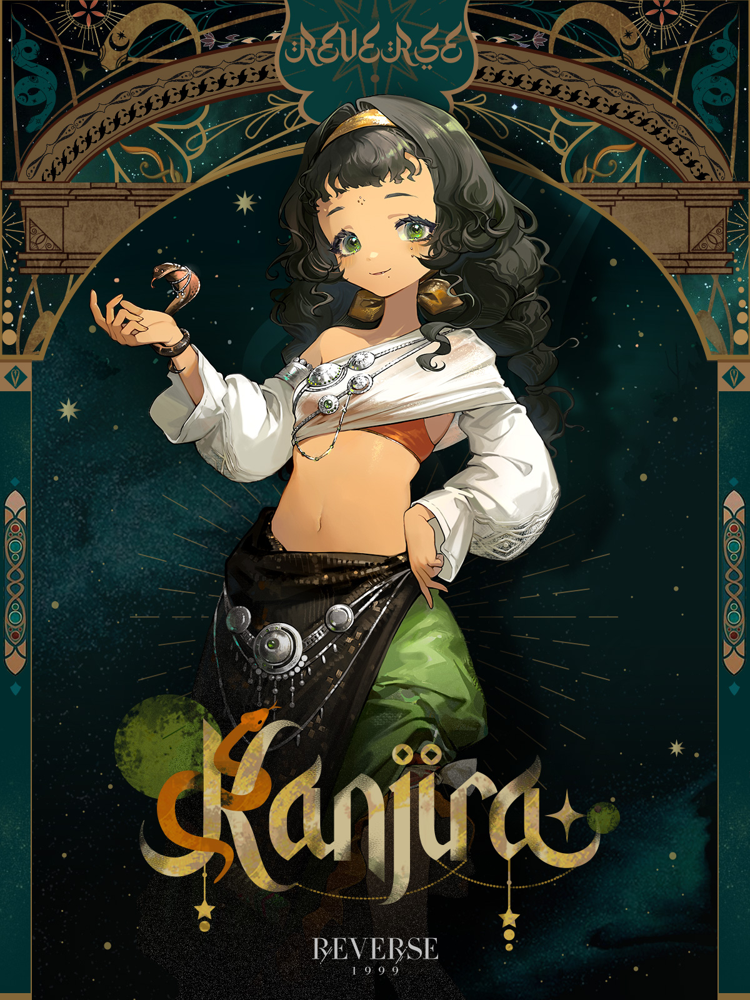
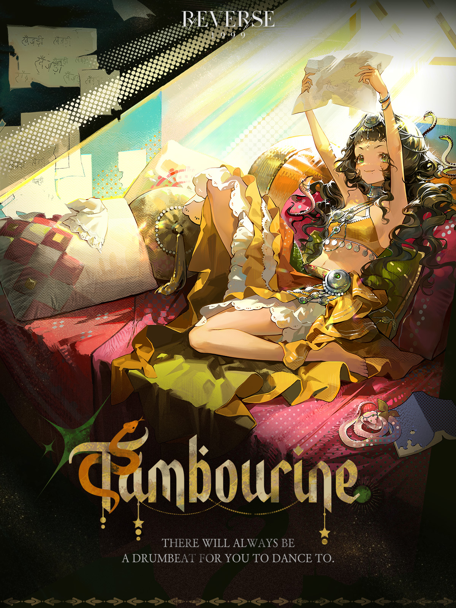

---
cssclasses:
  - reverse no-properties
---
**Insight Lvl. 30**

| Kanjira | Tambourine |
| --- | --- |
|  |  | 
*An arcanist's work exhibited in the 1940s for 25 years. Completed in autumn, on September 8. Completed in Birmingham, United Kingdom of Great Britain and Northern Ireland, the exhibit was transferred to New Delhi, British India 15 years later and went on an exhibition tour to Paris, French Republic.*
**Kanjira**  is a *Plant*  Arcanist. She is an ordinary, free-spirited wanderer, much like that ancient caravan left by her parents—just one of a million on the Southern lands. 

	
•·······•·······•·······•·······•

	<table>
		<tr><th colspan="6">Basic Statistics</th></tr>
		<tr>
			<th>Attribute</th>
			<th>Default   Base Lvl.</th>
			<th>Default   Max Lvl.</th>
			<th>Insight I   Max Lvl.</th>
			<th>Insight II   Max Lvl.</th>
			<th>Insight III   Max Lvl.</th>
		</tr>
		<tr>
			<th>Attack</th>
			<td>237</td>
			<td>360</td>
			<td>602</td>
			<td>897</td>
      <td>1055</td>
		</tr>
		<tr>
			<th>Health</th>
			<td>1312</td>
			<td>1992</td>
			<td>3339</td>
			<td>4979</td>
      <td>5857</td>
		</tr>
		<tr>
			<th>Real DEF</th>
			<td>112</td>
			<td>169</td>
			<td>284</td>
			<td>423</td>
      <td>498</td>
		</tr>
		<tr>
			<th>Mental DEF</th>
			<td>120</td>
			<td>182</td>
			<td>304</td>
			<td>454</td>
      <td>534</td>
		</tr>
		<tr>
			<th>Technique</th>
			<td>196</td>
			<td>196</td>
			<td>222</td>
			<td>248</td>
      <td>274</td>
		</tr>
	</table>
	
•·······•·······•·······•·······•

	<table>
		<tr><th colspan="5">Special Statistics</th></tr>
		<tr>
			<th>Attribute</th>
      <th>Default</th>
			<th>Insight I</th>
			<th>Insight II </th>
      <th>Insight III </th>
		</tr>
		<tr>
			<th>Crit. Rate</th>
			<td>6.5%</td>
			<td>7.4%</td>
			<td>8.3%</td>
      <td>9.1%</td>
		</tr>
		<tr>
			<th>Crit. DMG</th>
			<td>139.8%</td>
			<td>141.1%</td>
			<td>142.4%</td>
      <td>143.7%</td>
		</tr>
	</table>
	
•·······•·······•·······•·······•

	<table>
	<tr><th colspan="2">Seasoned Wanderer  Inheritance Effects</th></tr>
	<tr>
		<th></th>
		<td>When a round starts, performs 1 Divination and acquires each of these every round in the sequence provided. <i>[Emerald Fortune]</i>, <i>[Pearl Fortune]</i>, and <i>[Agate Fortune]</i> </td>
	</tr>
	<tr>
		<th></th>
		<td>DMG Taken <b>-8%</b> when the caster enters battle.</td>
	</tr>
  <tr>
		<th></th>
		<td>When attacking a target in <b>[Neg Status]</b> Ultimate Might <i>+10%</i> for the caster.  </td>
	</tr>
  <tr>
		<td colspan="2">
		<i>[Emerald Fortune]</i>: Enhances <i>[Hey, Punji!]</i> (cannot be dispelled).
		 <i>[Pearl Fortune]</i>: Enhances <i>[Oh, Divination!]</i> (cannot be dispelled).
		 <i>[Agate Fortune]</i>: Enhances <i>[Song of Wandering]</i> (cannot be dispelled).
		</td>
	</tr>
	</table>
		
•·······•·······•·······•·······•

	<table>
	<tr><th colspan="2">Portrait</th></tr>
	<tr> <th>Lvl. 1</th> <td><i>Seasoned Wanderer's</i> effect changes to: If the caster is in <i>[Emerald Fortune]</i>: status, when casting <i>[Hey, Punji!]</i>, inflicts <i>[Poison]</i> status with <b>+1</b> round of duration.  </td> </tr>
	<tr> <th>Lvl. 2</th> <td><i>Oh, Divination!</i>'s effect changes to: at <b>1/2/3</b> stars, deals <b>220/330/550%</b> Mental DMG.  </td> </tr>
	<tr> <th>Lvl. 3</th> <td> <i> Seasoned Wanderer</i>'s effect changes to: If the caster is in <i>[Agate Fortune]</i>: status, when casting <i>[Song of Wandering]</i>, Ultimate Might <b>+15%</b> </td> </tr>
	<tr> <th>Lvl. 4</th> <td><i>Hey, Punji!</i>'s effect changes to: <b>1/2/3</b> stars, deals <b>170/280/500%</b> Mental DMG. </td> </tr>
	<tr> <th>Lvl. 5</th> <td><i>Song of Wandering</i>'s effect changes to: deals <b>350%</b> Mental DMG. </td> </tr>
	</table>
	
•·······•·······•·······•·······•

	
•·······•·······•·······•·······•

	<table style="margin-bottom: 15px;">
		<tr><th rowspan="7"></th>
		<th colspan="3">Hey, Punji!   Arcane Skill </th>
		</tr>
		<tr>
			<th><b>★</b>☆☆</th>
			<td rowspan="2"> "Ф Forgive her."
			  1-target attack. Deals <b>150%</b> Mental DMG and inflicts <i>[Poison]</i> status on the target for 2 rounds: when a round ends, deals (the caster's ATK <b>×30%</b>) Genesis DMG. If the caster is in <i>[Emerald Fortune]</i> status, then inflicts 1 additional <i>[Poison]</i> status of the same type to the target.  </td>
		</tr>
		<tr><th>Attack</th></tr>
		<tr>
			<th><b>★★</b>☆</th>
			<td rowspan="2">  "Ф Forgive her. She didn't mean to poison."
			  1-target attack. Deals <b>250%</b> Mental DMG and inflicts <i>[Poison]</i> status on the target for 2 rounds: when a round ends, deals (the caster's ATK <b>×30%</b>) Genesis DMG. If the caster is in <i>[Emerald Fortune]</i> status, then inflicts 1 additional <i>[Poison]</i> status of the same type to the target.  </td>
		</tr>
		<tr><th>Attack</th></tr>
		<tr>
			<th><b>★★★</b></th>
			<td rowspan="2"> "Ф Forgive her. She didn't mean to poison... She just wanted to sell the cure."
			  1-target attack. Deals <b>450%</b> Mental DMG and inflicts <i>[Poison]</i> status on the target for 2 rounds: when a round ends, deals (the caster's ATK <b>×30%</b>) Genesis DMG. If the caster is in <i>[Emerald Fortune]</i> status, then inflicts 1 additional <i>[Poison]</i> status of the same type to the target.  </td>
		</tr>
		<tr><th>Attack</th></tr>
		<tr><td colspan="3"> <i>Poison</i>: At the end of a round, takes Genesis DMG based on the caster's ATK. Can stack. </td></tr>
	</table>
	<table style="margin-bottom: 15px;">
		<tr><th rowspan="7"></th>
		<th colspan="3"> Oh, Divination!   Arcane Skill </th>
		</tr>
		<tr>
			<th><b>★</b>☆☆</th>
			<td rowspan="2">  "Ф You understand." 
			  1-target attack. Deals <b>200%</b> Mental DMG. If the caster is in <i>[Pearl Fortune]</i> status, inflicts 1 additional stack of <i>[Confusion]</i> on the target. </td>
		</tr>
		<tr><th>Buff</th></tr>
		<tr>
			<th><b>★★</b>☆</th>
			<td rowspan="2"> "Ф You understand. Poor children are not interested in such things."
			  1-target attack. Deals <b>300%</b> Mental DMG. If the caster is in <i>[Pearl Fortune]</i> status, inflicts 1 additional stack of <i>[Confusion]</i> on the target. </td>
		</tr>
		<tr><th>Buff</th></tr>
		<tr>
			<th><b>★★★</b></th>
      <td rowspan="2">  "Ф You understand. Poor children are not interested in such things, but not if it helps them cheat and make money." 
			  1-target attack. Deals <b>500%</b> Mental DMG. If the caster is in <i>[Pearl Fortune]</i> status, inflicts 1 additional stack of <i>[Confusion]</i> on the target. </td>
		</tr>
		<tr><th>Buff</th></tr>
		<tr><td colspan="3"> <i>Confusion</i>: Critical Resist <b>-25%</b> (can stack; each stack is timed independently) </td></tr>
	</table>
	<table style="margin-bottom: 15px;">
		<tr><th rowspan="3"></th>
		<th colspan="2"> Song of Wandering   Ultimate </th>
		</tr>
		<tr>
			<td>  "Ф A spacious caravan and beautiful posters. Punji... Bring them along. The day will come when she sets off." 
			  Mass attack. Deals <b>300%</b> Mental DMG to all enemies. This attack enjoys Ultimate Might <b>+10%</b>. If the caster is in <i>[Agate Fortune]</i> status, gains additional Ultimate Might <b>+15%</b>.  </td>
		</tr>
	</table>
	
•·······•·······•·······•·······•

