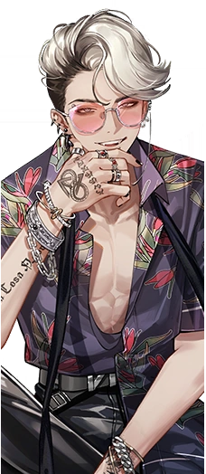
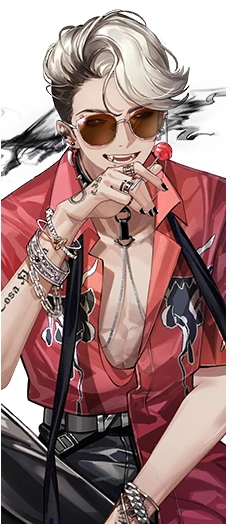

---
cssclasses:
  - reverse no-properties
---
| Pavia | My Dear Good Friends | The Leap of a Wolf |
| --- | --- | --- |
|  |  |  |
*A mixed's work. Exhibited in the 1990s for 25 years. Completed in Summer, on July 24. Born in Rome, Italian Republic, and after three months, the exhibit was sent to Piedmont and stayed there for more than ten years before moving to Sicily.*
**Pavia**  is an independent *:ReBeast:Beast*  mercenary lacking in collaborative skills. Employers are content with his excellent abilities, but can't stand his work ethic of ignoring his coworkers.

•·······•·······•·······•·······•

	<table>
		<tr><th colspan="5">Basic Statistics</th></tr>
		<tr>
			<th>Attribute</th>
			<th>Default   Base Lvl.</th>
			<th>Default   Max Lvl.</th>
			<th>Insight I   Max Lvl.</th>
			<th>Insight II   Max Lvl.</th>
		</tr>
		<tr>
			<th>Attack</th>
			<td>264</td>
			<td>401</td>
			<td>672</td>
			<td>1002</td>
		</tr>
		<tr>
			<th>Health</th>
			<td>1064</td>
			<td>1615</td>
			<td>2706</td>
			<td>4035</td>
		</tr>
		<tr>
			<th>Real DEF</th>
			<td>99</td>
			<td>150</td>
			<td>252</td>
			<td>376</td>
		</tr>
		<tr>
			<th>Mental DEF</th>
			<td>83</td>
			<td>125</td>
			<td>210</td>
			<td>313</td>
		</tr>
		<tr>
			<th>Technique</th>
			<td>250</td>
			<td>250</td>
			<td>283</td>
			<td>316</td>
		</tr>
	</table>
	
•·······•·······•·······•·······•

	<table>
		<tr><th colspan="4">Special Statistics</th></tr>
		<tr>
			<th>Attribute</th>
			<th>Default  </th>
			<th>Insight I</th>
			<th>Insight II </th>
		</tr>
		<tr>
			<th>Crit. Rate</th>
			<td>8.3%</td>
			<td>9.4%</td>
			<td>10.5%</td>
		</tr>
		<tr>
			<th>Crit. DMG</th>
			<td>142.5%</td>
			<td>144.2%</td>
			<td>145.8%</td>
		</tr>
	</table>
	
•·······•·······•·······•·······•

	<table>
	<tr><th colspan="2">A Great Thing  Inheritance Effects</th></tr>
	<tr>
		<td></td>
		<td>Every time an ally dies, DMG Dealt, Critical Rate and Critical Resist Rate <b>+10%</b>, and DMG Taken <b>-10%</b>.</td>
	</tr>
	<tr>
		<td></td>
		<td>Every time an ally dies, DMG Dealt, Critical Rate and Critical Resist Rate <b>+10%</b>, and DMG Taken <b>-10%</b>.</td>
	</tr>
	</table>

	<table style="margin-bottom: 15px;">
		<tr><th rowspan="7"></th>
		<th colspan="3">Dirty Thing   Arcane Skill </th>
		</tr>
		<tr>
			<th><b>★</b>☆☆</th>
			<td rowspan="2"> "Ф Sometimes, people can find iron-nickel bullets."
			  Mass attack. Deals <b>120%</b> Mental DMG to 2 enemies. If the caster's HP is <i>above</i> <b>50%</b>, this attack deals <b>50%</b> more Mental DMG.</td>
		</tr>
		<tr><th>Attack</th></tr>
		<tr>
			<th><b>★★</b>☆</th>
			<td rowspan="2"> "Ф Sometimes, people can find iron-nickel bullets at places splattered with fresh blood."
			  Mass attack. Deals <b>180%</b> Mental DMG to 2 enemies. If the caster's HP is <i>above</i> <b>50%</b>, this attack deals <b>75%</b> more Mental DMG.</td>
		</tr>
		<tr><th>Attack</th></tr>
		<tr>
			<th><b>★★★</b></th>
			<td rowspan="2"> "Ф Sometimes, people can find iron-nickel bullets with stick sugar at places splattered with fresh blood."
			  Mass attack. Deals <b>300%</b> Mental DMG to 2 enemies. If the caster's HP is <i>above</i> <b>50%</b>, this attack deals <b>125%</b> more Mental DMG.</td>
		</tr>
		<tr><th>Attack</th></tr>
	</table>
	<table style="margin-bottom: 15px;">
		<tr><th rowspan="7"></th>
		<th colspan="3">Poor Sod   Arcane Skill </th>
		</tr>
		<tr>
			<th><b>★</b>☆☆</th>
			<td rowspan="2"> "Ф A crude art."
			  Mass attack. Deals <b>135%</b> Mental DMG to 2 enemies. If the caster's HP is <i>below</i> <b>50%</b>, this attack deals <b>40%</b> more Mental DMG.</td>
		</tr>
		<tr><th>Attack</th></tr>
		<tr>
			<th><b>★★</b>☆</th>
			<td rowspan="2"> "Ф A crude art that could be the handiwork of an inept vet."
			  Mass attack. Deals <b>200%</b> Mental DMG to 2 enemies. If the caster's HP is <i>below</i> <b>50%</b>, this attack deals <b>60%</b> more Mental DMG.</td>
		</tr>
		<tr><th>Attack</th></tr>
		<tr>
			<th><b>★★★</b></th>
			<td rowspan="2"> "Ф A crude art that could be the handiwork of an inept vet. That's what we're guessing."
			  Mass attack. Deals <b>330%</b> Mental DMG to 2 enemies. If the caster's HP is <i>below</i> <b>50%</b>, this attack deals <b>100%</b> more Mental DMG.</td>
		</tr>
		<tr><th>Attack</th></tr>
	</table>
	<table style="margin-bottom: 15px;">
		<tr><th rowspan="4"></th>
		<th colspan="3">Nosier Than Me   Ultimate </th>
		</tr>
		<tr>
			<th><b>★</b>☆☆</th>
			<td rowspan="2"> "Ф A crude art."
			  Mass attack. Deals <b>135%</b> Mental DMG to 2 enemies. If the caster's HP is <i>below</i> <b>50%</b>, this attack deals <b>40%</b> more Mental DMG.</td>
		</tr>
		<tr><th>Attack</th></tr>
	</table>
	
•·······•·······•·······•·······•

