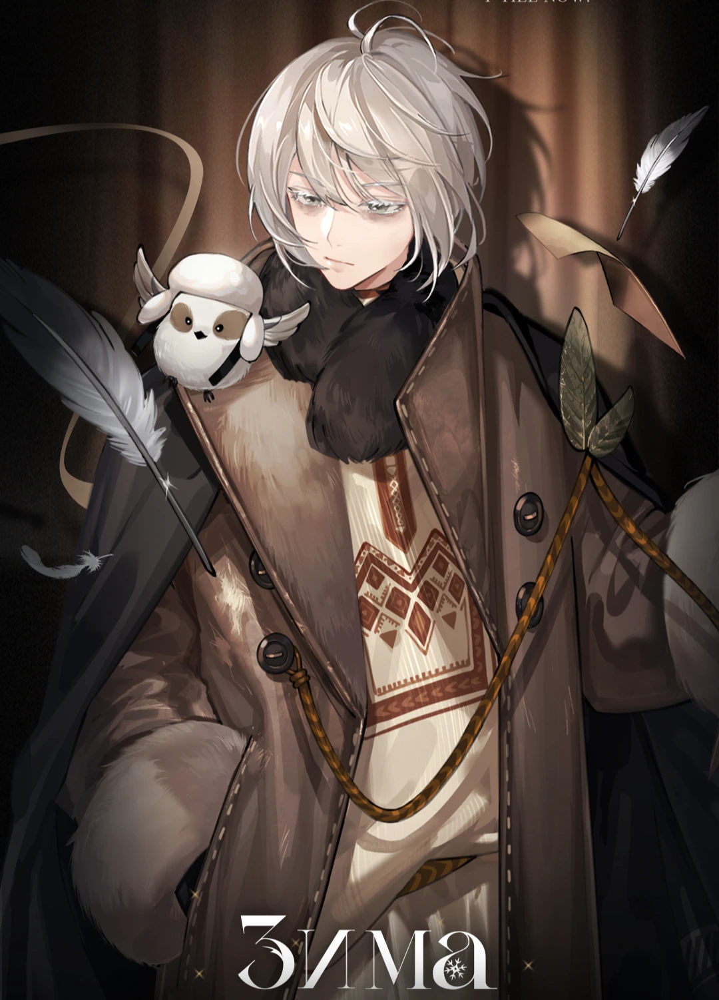
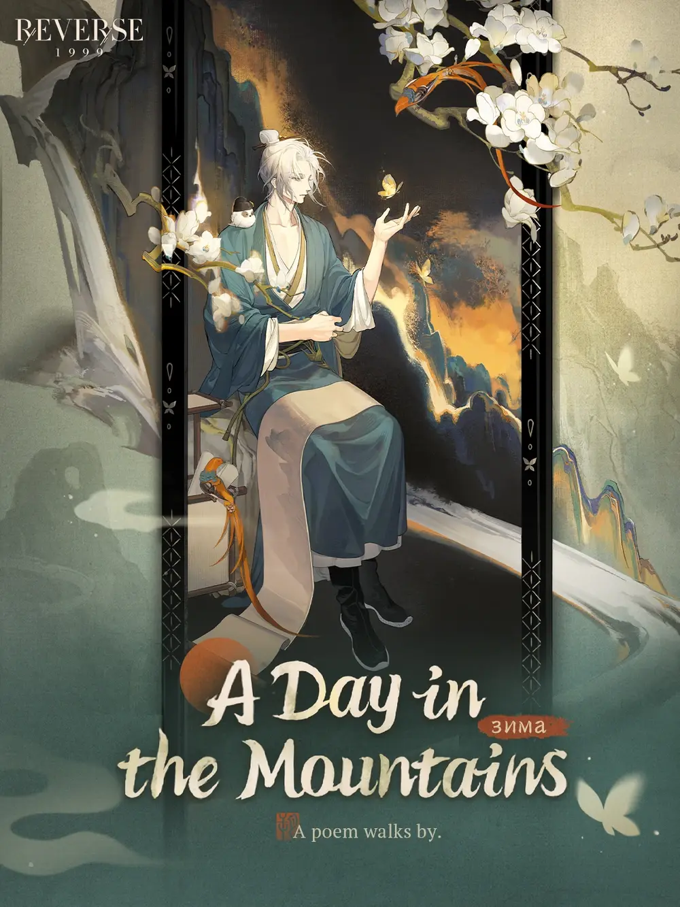

---
cssclasses:
  - reverse no-properties
---
**Insight I Lvl. 40**

| Зима | The Loner |
| --- | --- |
|  |  | 
*An arcanist's work. Exhibited in the early 20th century for 29 years Completed in Spring, on April 28. Exhibited in some exile land which belonged to the Russian Empire.*
**Зима**  is a *Plant*  Arcanist. A socially inept poet. He is silent and dispirited, with few changes of expression. He only becomes poetic when he's with birds and other animal friends. 

	
•·······•·······•·······•·······•

	<table>
		<tr><th colspan="6">Basic Statistics</th></tr>
		<tr>
			<th>Attribute</th>
			<th>Default   Base Lvl.</th>
			<th>Default   Max Lvl.</th>
			<th>Insight I   Max Lvl.</th>
			<th>Insight II   Max Lvl.</th>
		</tr>
		<tr>
			<th>Attack</th>
			<td>242</td>
			<td>368</td>
			<td>616</td>
			<td>919</td>
		</tr>
		<tr>
			<th>Health</th>
			<td>1263</td>
			<td>1917</td>
			<td>3214</td>
			<td>4793</td>
		</tr>
		<tr>
			<th>Real DEF</th>
			<td>106</td>
			<td>161</td>
			<td>269</td>
			<td>401</td>
		</tr>
		<tr>
			<th>Mental DEF</th>
			<td>106</td>
			<td>161</td>
			<td>269</td>
			<td>401</td>
		</tr>
		<tr>
			<th>Technique</th>
			<td>175</td>
			<td>175</td>
			<td>198</td>
			<td>221</td>
		</tr>
	</table>
	
•·······•·······•·······•·······•

	<table>
		<tr><th colspan="5">Special Statistics</th></tr>
		<tr>
			<th>Attribute</th>
      <th>Default</th>
			<th>Insight I</th>
			<th>Insight II </th>
		</tr>
		<tr>
			<th>Crit. Rate</th>
			<td>5.8%</td>
			<td>6.6%</td>
			<td>7.4%</td>
		</tr>
		<tr>
			<th>Crit. DMG</th>
			<td>138.8%</td>
			<td>139.9%</td>
			<td>141%</td>
		</tr>
	</table>
	
•·······•·······•·······•·······•

	<table>
	<tr><th colspan="2">Island  Inheritance Effects</th></tr>
	<tr>
		<th></th>
		<td>When the caster attacks, if the caster's HP is above <b>50%</b>, Penetration Rate <b>+10%</b>. When the caster is attacked, if the caster's HP is below <b>50%</b>, DMG Taken <b>-10%</b>. </td>
	</tr>
	<tr>
		<th></th>
		<td>DMG Dealt <b>+8%</b> when the caster enters battle.</td>
	</tr>
	</table>
		
•·······•·······•·······•·······•

	<table>
	<tr><th colspan="2">Portrait</th></tr>
	<tr> <th>Lvl. 1</th> <td> <i> <i>Poem, Island, Breeze</i>'s effect changes to: deals <b>280%</b>, Mental DMG. </td> </tr>
	<tr> <th>Lvl. 2</th> <td> <i> Sparrow</i>'s effect changes to: at <b>1/2/3</b> stars, deals <b>220/230/350%</b> Mental DMG. </td> </tr>
	<tr> <th>Lvl. 3</th> <td> <i> Paper</i>'s effect changes to: at <b>1/2/3</b> stars, deals <b>+20/25/30%</b> Mental DMG. </td> </tr>
	<tr> <th>Lvl. 4</th> <td> <i> Poem, Island, Breeze</i>'s effect changes to: deals <b>310%</b>, Mental DMG. </td> </tr>
	<tr> <th>Lvl. 5</th> <td> <i> Poem, Island, Breeze</i>'s effect changes to: deals <b>350%</b>, Mental DMG. </td> </tr>
	</table>
	
•·······•·······•·······•·······•

	
•·······•·······•·······•·······•

	<table style="margin-bottom: 15px;">
		<tr><th rowspan="7"></th>
		<th colspan="3">Sparrow   Arcane Skill </th>
		</tr>
		<tr>
			<th><b>★</b>☆☆</th>
			<td rowspan="2"> "Ф Nature's gift to humanity."
			  1-target attack. Deals <b>200%</b> Mental DMG. </td>
		</tr>
		<tr><th>Attack</th></tr>
		<tr>
			<th><b>★★</b>☆</th>
			<td rowspan="2">  "Ф Nature's gift to humanity. Examples include birds chirping."
			  1-target attack. Deals <b>200%</b> Mental DMG and inflicts <i>[Silence]</i> status for 1 round. </td>
		</tr>
		<tr><th>Attack</th></tr>
		<tr>
			<th><b>★★★</b></th>
			<td rowspan="2"> "Ф Nature's gift to humanity. Examples include the wind from frost-covered isles." 
			  1-target attack. Deals <b>200%</b> Mental DMG and inflicts <i>[Silence]</i> status for 1 round. </td>
		</tr>
		<tr><th>Attack</th></tr>
		<tr><td colspan="3"> <i>Poison</i>: At the end of a round, takes Genesis DMG based on the caster's ATK. Can stack. </td></tr>
	</table>
	<table style="margin-bottom: 15px;">
		<tr><th rowspan="7"></th>
		<th colspan="3"> Paper   Arcane Skill </th>
		</tr>
		<tr>
			<th><b>★</b>☆☆</th>
			<td rowspan="2">  "Ф Text written on parchment." 
			  Mass buff. DMG Dealt <b>+15%</b> and DMG Heal <b>+15%</b> for all allies for 2 rounds. </td>
		</tr>
		<tr><th>Buff</th></tr>
		<tr>
			<th><b>★★</b>☆</th>
			<td rowspan="2">  "Ф Text written on torn and charred parchment." 
			  Mass buff. DMG Dealt <b>+20%</b> and DMG Heal <b>+20%</b> for all allies for 2 rounds. </td>
		</tr>
		<tr><th>Buff</th></tr>
		<tr>
			<th><b>★★★</b></th>
      <td rowspan="2">  "Ф Text written on torn and charred parchment, but epics will endure forever." 
			  Mass buff. DMG Dealt <b>+20%</b> and DMG Heal <b>+20%</b> for all allies for 2 rounds. </td>
		</tr>
		<tr><th>Buff</th></tr>
	</table>
	<table style="margin-bottom: 15px;">
		<tr><th rowspan="2"></th>
		<th colspan="2"> Poem, Island, Breeze   Ultimate </th>
		</tr>
		<tr>
			<td>  "Ф Many things have been written on paper. We have praises, histories, and orders of exile." 
			  Mass attack. Deals <b>250%</b> Mental DMG to all enemies. On hitting the main target, inflicts the <i>[Seal]</i> status on the main target for 2 rounds. </td>
		</tr>
		<tr><td colspan="3"><b>Seal</b>: Cannot use Ultimate.</td></tr>
	</table>
	
•·······•·······•·······•·······•

