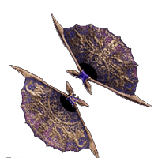

---
cssclasses:
  - mhw
  - code
---

	

		

			<h3>Holy Swords</h3>
			
			
 Ceremonial equipment of the city guardsmen, though their bite is anything but ornamental. 

			

			<b>Attack:</b> 252 <b>Element:</b> 💦 120  
			  <b>Affinity:</b> 0%  
			  <b>Decorations:</b> 1  <i>Level 3</i>  Slot  
			  <b>Sharpness:</b> 🔵
			

			
-- -- -- -- --

			

			<b>High Commendation:</b> x3 
			 HR 8★ Optional Quests 
			 <b>Dragonvein Crystal:</b> x6  
			 High Rank  
			 <b>Wyvern Gem:</b> x2  
			 High Rank  
			 <b>Nova Crystal:</b> x2  
			 High Rank Mining  
			 32,000 🪙
			

		

	

	
	

		

			<h3>Wolf Tessen</h3>
			
			
 A single flutter shreds prey in the blink of an eye. 

			

			<b>Attack:</b> 378 <b>Element:</b> ☠️ 210  
			  <b>Affinity:</b> 20%  
			  <b>Decorations:</b> 1  <i>Level 3</i>  Slot  
			  <b>Sharpness:</b> 🟣
			

			
-- -- -- -- --

			

			<b>Large Wyvern Gem:</b> x1
			 <b>M★1</b> A wyvern gem that has grown further over the ages. Emits a mesmerizing shimmer. 
			 <b>Fancy Beak:</b> x3
			 <b>M★6</b> Very rare Yian Garuga material. Obtained by breaking its head. Stout, used in many weapons. 
			 <b>Garuga Fellwing:</b> x2
			 <b>M★6</b> Very rare Yian Garuga material. Obtained by breaking its wings. Supple, used to craft gear. 
			 <b>Scratched Shell:</b> x3  
			 <b>M★6</b> Very rare Scarred Yian Garuga material. Mostly obtained as a reward. Special, hardened material. 
			 32,000 🪙
				
-- -- -- -- --

			

		

		

			<h3> Ruinous Extermination</h3>
			
			
 Bow low, condemned one. This Ruiner Nergigante long sword serves as an executioner's blade. 

			

			<b>Attack:</b> 957 <b>Element:</b> 🐲 180  
			  <b>Affinity:</b> 0%  
			  <b>Decorations:</b> 1  <i>Level 3</i>  Slot  
			  <b>Sharpness:</b> ⚪
			

			
-- -- -- -- --

			

			<b>Large Elder Dragon Gem:</b> x1
			 <b>M★5</b> A giant, ultra-rare stone that forms inside an Elder Dragon once in a millennium. 
			 <b>Annihilating Greathorn:</b> x3
			 <b>M★6</b> Very rare Ruiner Nergigante material. Obtained by breaking its horns. Stout, used in many weapons. 
			 <b>Nergigante Hardclaw:</b> x4
			 <b>M★6</b> Very rare Ruiner Nergigante material. Mostly obtained by carving. Sharp, used in many weapons. 
			 <b>Eternal Regrowth Plate:</b> x5 
			 <b>M★6</b> Very rare Ruiner Nergigante material. Obtained by collecting rare drops. Unusual, used to craft gear. 
			 32,000 🪙
			

		

	

