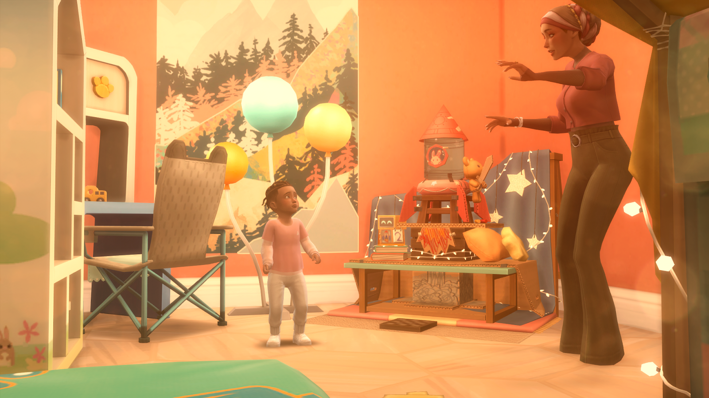

# Generation 1
## ⋅•⋅⋅•⋅⊰⋅•⋅⋅•⋅⋅•⋅⋅•⋅∙∘☽⋅Dr༓Maggie༓Benali⋅☾∘∙•⋅⋅⋅•⋅⋅⊰⋅•⋅⋅•⋅⋅•⋅⋅•⋅
### •⋅⋅⋅•⋅⋅∘She | Her∘⋅⋅•⋅⋅•

Maggie Benali immigrated from Dorados when she went to the University of Britechester. She adverts any questions about her life beforehand. She was entirely focused on getting her PHD, and making new friends. Later on in her school career, she went on many dig sites. Realizing how much she missed Salim, she went out of her way to talk to him while she was gone. And quickly their friendship blossomed into a romance.
#### ━◦○◦━Young Adult━◦○◦━
Maggie had gotten her PHD and was now working as an Archeologist for San Myshuno’s Las Meninas History Museum. She was regularly sent out on digs in conjunction with the El Salvadoran government, so was away from home many months at a time. Her team would find and repair artifacts, give them to the El Salvadoro, and the government would give them pieces as thanks. She loved her work, but she missed Salim quite dearly. Any chance that she could get, she would call him and talk to him. When she is back at home, she always makes sure to visit Roxanne and her classes to teach them about various world cultures.
### ━◦○◦━Adult━◦○◦━
Maggie's career was turned upside down when she realized that she was pregnant in the middle of a dig out in the jungle. Whether or not she got an abortion, she knew she had to return back to San Myshuno. She knew an abortion would devastate both her and her husband Salim, so she decided to keep the baby. Which, in her opinion, was the best decision of her life. Izaiah was the greatest gift that Allah had ever given her.  
To continue supporting her family, since she was the main source of income, she continued working for the museum. She doesn’t accept offers for digs that last half a year anymore, but she’s still in and out of San Myshuno every few weeks. As much as she laments missing some of her son Izaiah's most formative years, the whole family knows that it was necessary to keep the family afloat. She spends as much time as possible with him, trying to catch up on all the times that she had missed.

### ━◦○◦━Elder━◦○◦━
At some point, Maggie realizes that her old age has caught up to her. And she and Salim move to Tortosa with their old college friends Roxanne and Tatsuya. She hates being out of work though. So while Salim is busy enjoying the town, she works as the Museum director at the Historical Thebe Estate. She’s no longer working long weekends, she regularly travels to Newcrest to visit her grandchildren with Salim. She regularly goes metal detecting on the beach. Look for lost remnants of a potential fallen mermaid society called… Atlantis.
⋅•⋅⋅⋅•⋅⋅⊰⋅•⋅⋅•⋅⋅•⋅⋅•⋅⋅•⋅⋅•⋅⊰⋅•⋅⋅•⋅⋅•⋅⋅•⋅∙∘༓∘∙•⋅⋅⋅•⋅⋅⊰⋅•⋅⋅•⋅⋅•⋅⋅•⋅⋅•⋅⋅•⋅⊰⋅•⋅⋅•⋅⋅•⋅⋅•⋅