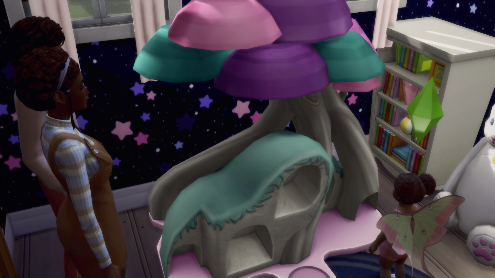

# Generation 1
## ⋅•⋅⋅•⋅⊰⋅•⋅⋅•⋅⋅•⋅⋅•⋅∙∘☽⋅Dr༓Maggie༓Benali༓(SHE/HER)⋅☾∘∙•⋅⋅⋅•⋅⋅⊰⋅•⋅⋅•⋅⋅•⋅⋅•⋅
Maggie Benali immigrated from Dorados when she went to the University of Britechester. She adverts any questions about her life beforehand. She was entirely focused on getting her PHD, and making new friends. Later on in her school career, she went on many dig sites. Realizing how much she missed Salim, she went out of her way to talk to him while she was gone. And quickly their friendship blossomed into a romance.
#### ━◦○◦━Young Adult━◦○◦━
Maggie had gotten her PHD and was now working as an Archeologist for San Myshuno’s Las Meninas History Museum. She was regularly sent out on digs in conjunction with the El Salvadoran government, so was away from home many months at a time. Her team would find and repair artifacts, give them to the El Salvadoro, and the government would give them pieces as thanks. She loved her work, but she missed Salim quite dearly. Any chance that she could get, she would call him and talk to him. When she is back at home, she always makes sure to visit Roxanne and her classes to teach them about various world cultures.
### ━◦○◦━Adult━◦○◦━
Maggie's career was turned upside down when she realized that she was pregnant in the middle of a dig out in the jungle. Whether or not she got an abortion, she knew she had to return back to San Myshuno. She knew an abortion would devastate both her and her husband Salim, so she decided to keep the baby. Which, in her opinion, was the best decision of her life. Izaiah was the greatest gift that Allah had ever given her.  
To continue supporting her family, since she was the main source of income, she continued working for the museum. She doesn’t accept offers for digs that last half a year anymore, but she’s still in and out of San Myshuno every few weeks. As much as she laments missing some of her son Izaiah's most formative years, the whole family knows that it was necessary to keep the family afloat. She spends as much time as possible with him, trying to catch up on all the times that she had missed.

### ━◦○◦━Elder━◦○◦━
At some point, Maggie realizes that her old age has caught up to her. And she and Salim move to Tortosa with their old college friends Roxanne and Tatsuya. She hates being out of work though. So while Salim is busy enjoying the town, she works as the Museum director at the Historical Thebe Estate. She’s no longer working long weekends, she regularly travels to Newcrest to visit her grandchildren with Salim. She regularly goes metal detecting on the beach. Look for lost remnants of a potential fallen mermaid society called… Atlantis.

<b><i>⋅•⋅⋅⋅•⋅⋅⊰⋅•⋅⋅•⋅⋅•⋅⋅•⋅⋅•⋅⋅•⋅⊰⋅•⋅⋅•⋅⋅•⋅⋅•⋅∙∘༓∘∙•⋅⋅⋅•⋅⋅⊰⋅•⋅⋅•⋅⋅•⋅⋅•⋅⋅•⋅⋅•⋅⊰⋅•⋅⋅•⋅⋅•⋅⋅•⋅</i></b>

## ⋅•⋅⋅•⋅⊰⋅•⋅⋅•⋅⋅•⋅⋅•⋅∙∘☽⋅Salim༓Benali༓(HE/HIM)⋅☾∘∙•⋅⋅⋅•⋅⋅⊰⋅•⋅⋅•⋅⋅•⋅⋅•⋅
While Salim was in college, he worked for the University of Britchester. He went around the Rue District writing reviews on the local cuisines. He took this as an advantage to take Maggie out on tons of dates. And even when she was busy, he would take Tatsuya and his girlfriend Roxanne around the city. Tatsuya liked to say he was, “being the angel of a wing man that the gods sent down to Earth”. 
### ━◦○◦━Young Adult━◦○◦━
Salim is quite lonely living in the apartment all by himself. He hangs out with Tatsuya very often. They occasionally go out to coffee shops together to write. As a mystery writer, he's definitely made Soogle searches that have put him on watch lists. While the circumstances are bitter sweet, he's glad to throw himself into his childhood passions once again.
Like Tatsuya, he’s also a journalist. But his concentration is on sports, not social issues. He travels around to highschools and colleges interviewing students. He’s helping Roxanne with finding supporters for various scholarships. During this time, he also finally had enough money to get his autism diagnosis!
### ━◦○◦━Adult━◦○◦━
Although the circumstances around the pregnancy were troubling, Salim is extremely grateful for the birth of his son. As a family oriented man, he’s wanted nothing more than to settle down and eventually start a family with Maggie. And although the circumstances are unconventional, he’s joyous that his dreams came true.
A small part of him is glad that Izaiah was born mute. On the many parenting forums he read, he learned that people with autism can easily get overstimulated with children’s loudness and unpredictability. And considering he’s the main parent, he didn’t want to accidentally traumatize his child. Salim always took Izaiah on playdates to Tatsuya’s house when Izaiah got a little restless in the house. And he loved watching the blossoming friendship between Izaiah and Jase. 
### ━◦○◦━Elder━◦○◦━
Salim always knew that Jazymine and Izaiah would get married. Their entire childhood, he watched Izaiah follow Jase around like she hung the stars in the sky. And now that he’s an elder, he’s thoroughly enjoying the money he won from Tatsuya from their “will they/won't they” bet. His mystery novels have been out for a few years now, and they’ve garnered a good portion of devoted fans. Every few months he travels back to San Myshuno to do a book signing charity event at Cumin Elementary.

<b><i>⋅•⋅⋅⋅•⋅⋅⊰⋅•⋅⋅•⋅⋅•⋅⋅•⋅⋅•⋅⋅•⋅⊰⋅•⋅⋅•⋅⋅•⋅⋅•⋅∙∘༓∘∙•⋅⋅⋅•⋅⋅⊰⋅•⋅⋅•⋅⋅•⋅⋅•⋅⋅•⋅⋅•⋅⊰⋅•⋅⋅•⋅⋅•⋅⋅•⋅</i></b>

## ⋅•⋅⋅•⋅⊰⋅•⋅⋅•⋅⋅•⋅⋅•⋅∙∘☽⋅Dr༓Roxanne༓Kato༓(SHE/HER)⋅☾∘∙•⋅⋅⋅•⋅⋅⊰⋅•⋅⋅•⋅⋅•⋅⋅•⋅
Not much is known about Roxanne Kato’s early life. It’s almost as if she spawned out of nowhere! Roxanne was born on Chive Street in Rue, San Myshuno. She lived in San Myshuno until she went to Britechester for college. In Britechester she met her future husband, Tatsuya, and close friends Maggie and Salim. 
### ━◦○◦━Young Adult━◦○◦━
Roxanne and Tatsuya married soon after she graduated from Britechester. Her parents were upset with her career and marriage choices and disowned her. She was devastated due to the close relationship she had with them. Tatsuya, Maggie, and Salim supported her through her depression slump, and she’s back better than before.
Roxanne's an amazing teacher and wife. She got fired from her first teaching job for drastically improving the curriculum for her students without approval from the board. And while she misses her first students dearly, she's grateful that her new job at Cumin Elementary allows instructors more freedom. Due to her own poor upbringing, she works tirelessly to improve the lives of her students from the low-income area she was born in.
### ━◦○◦━Adult━◦○◦━
When she isn't grading papers and working on her curriculum, Roxanne spends as much time as possible with her husband and child. She loves Tatsuya with all her heart and is eternally grateful that he put his dream's to the wayside to raise their young daughter Jazymine. On the weekends, Roxanne occasionally goes on outings with her family and the Benalis’. She attends night school to pursue a doctorate in Child Development.

### ━◦○◦━Elder━◦○◦━
Roxanne retired after spending 20 years as the superintendent of the Rue District to Tortosa with Tatsuya . They live near Maggie and Salim in Porto Luminoso. While the husbands are at home writing, she spends the long days going on walks with Maggie on the beach. Her relationship with her daughter, while never bad, drastically improved now that she has more free time to spend with her. Roxanne and Jazymine go out on little coffee dates in town, while Tatsuya looks after the kids. She spends the rest of her days, happy, peaceful and going on double dates with Maggie and Salim.

<b><i>⋅•⋅⋅⋅•⋅⋅⊰⋅•⋅⋅•⋅⋅•⋅⋅•⋅⋅•⋅⋅•⋅⊰⋅•⋅⋅•⋅⋅•⋅⋅•⋅∙∘༓∘∙•⋅⋅⋅•⋅⋅⊰⋅•⋅⋅•⋅⋅•⋅⋅•⋅⋅•⋅⋅•⋅⊰⋅•⋅⋅•⋅⋅•⋅⋅•⋅</i></b>

## ⋅•⋅⋅•⋅⊰⋅•⋅⋅•⋅⋅•⋅⋅•⋅∙∘☽⋅Tatsuya༓Kato༓(HE/HIM)⋅☾∘∙•⋅⋅⋅•⋅⋅⊰⋅•⋅⋅•⋅⋅•⋅⋅•⋅
Tatsuya Kato was born in Wakaba, Mount Komorebi. His parents died when he was very young in an unfortunate mountain climbing accident. The orphanage in Mount Komorebi was full, so he was sent to their sister location, Guernica Orphanage. He did not have a fun experience growing up there. His only sense of enjoyment came from writing letters to his pen pal, Salim Benali. And the two of them eventually went to college together, and met their future wives and soulmates.
### ━◦○◦━Young Adult━◦○◦━
Tatsuya loves being a househusband. But that doesn't mean he’s unemployed! After he finishes doing his chores, he spends the day writing articles for The Cardamom Paper. He travels all around Rue District writing articles about its citizens and struggles. The Rue District being the poorest district in all of San Myshuno. He forms deeper bonds with his interviewees, and writes their emotions so well it brings even the coldest of hearts to tears.  
And on the days he has off, he works on the horror novel he started way back in highschool. He and his childhood penpal Salim started a competition over who can write the best book. Quickly, however, they forgot all about the competition after discovering a mutual love of writing.
### ━◦○◦━Adult━◦○◦━
Due to Roxanne’s unexpected pregnancy, Tatsuya put his career on hold to take care of the baby after her leave was over. They had quickly come to a mutual agreement that Roxanne was extremely important to the development of many young children, and she couldn’t abandon them soon after she gained their trust. He still writes articles for the Cardamon, but he spends his days neck deep in baby bonnets and milk bottles. Salim and Maggie also have a baby shortly after, and the two fathers spend many days helping each other. Many parents of students Maggie teaches, and old patrons of Tatsuya’s pitch in to help when the going gets tough. It truly takes a village.  
With their children growing fast, Tatsuya and Salim find their hands fully running after Jase and Izaiah. But when they finally go down for a nap, Tatsuya thrusts himself into his writing. At night, he could be found writing variously in the shared office. Working next to Maggie reminds him of their life in college. Jokingly, he likes to say that Jase and Izaiah are the inspiration for his horror monsters. With all the trouble they manage to get themselves into. And it helps to channel his (justified) anger at them into a more productive outlet.
### ━◦○◦━Elder━◦○◦━
Tatsuya has finally published his horror novel! It only took him 45 years. Tatsuya feels like there's a weight off his shoulders, now that his magnum opus is completed. And he’s making enough money from royalties that he and Roxanne can live comfortably in Tortosa. They live on a cliff side villa, large enough to house the grandkids when they inevitably come to visit every few months. He loves those three like they’re his own daughter. Much to Jazymine’s delight. He feels just slightly vindictive of the children giving Jase even more trouble then she ever gave him. Every few days, Tatsuya and Salim go and talk shit about the writing community in the local cafe.

<b><i>⋅•⋅⋅⋅•⋅⋅⊰⋅•⋅⋅•⋅⋅•⋅⋅•⋅⋅•⋅⋅•⋅⊰⋅•⋅⋅•⋅⋅•⋅⋅•⋅∙∘༓∘∙•⋅⋅⋅•⋅⋅⊰⋅•⋅⋅•⋅⋅•⋅⋅•⋅⋅•⋅⋅•⋅⊰⋅•⋅⋅•⋅⋅•⋅⋅•⋅</i></b>

# Generation 2
## ⋅•⋅⋅•⋅⊰⋅•⋅⋅•⋅⋅•⋅⋅•⋅∙∘☽⋅Dr༓Jazymine༓Kato༓(SHE/HER)⋅☾∘∙•⋅⋅⋅•⋅⋅⊰⋅•⋅⋅•⋅⋅•⋅⋅•⋅
### ━◦○◦━Toddler/Child━◦○◦━
Jaymine was a cryptic pregnancy. She was born on vacation in Tortosa, after parents won a surprise three month getaway from sweepscapes. Jazymine is a sun child. She's always been strong-willed; especially way back when she decided she didn't want to be a boy when she was a toddler. She forms an opinion, and sticks with it until there is substantial evidence proving otherwise. Much to her father’s annoyance, those opinions were mostly on eating vegetables.
Even as a young child, Jase had an obsession with space, aliens, and the mysterious planet Sixam. She filled her room with space themed items, all the way up to when she moved out of home. While her parents were poor, they made sure to invest in her interests and hyperfixations. She attended space camp every year. And while they’re room stayed relatively bare, they made sure to decorate Jase’s room as much as they could with their income.
### ━◦○◦━Teen━◦○◦━
Through preschool to high school, Jase and Iza were thick as thieves and getting into trouble like ones too. From disappearing as soon as your back is turned, to almost being eaten by the neighbor's cow plant, those two terrors were always up to something. Her mischievous ways did not impact her studious nature, however. She excelled in science and astronomy throughout her school years. And even found time to be President of the Debate Club. She prided herself in taking all AP classes. Her family was extremely proud. She graduated high school a full two years early and immediately started going for her masters. By the time she was 21, she had gotten her Doctorate in Astrophysics on an accelerated track.
### ━◦○◦━Young Adult━◦○◦━
Ever since she was a young girl, Jazymine has loved Izaiah. They’re her childhood best friend and have always stuck by her throughout the years. They’ve been there for her rocky elementary school years, her transition, her emo phase in high school, everything. He's her silent rock in the tumultuous sea that is life. So when they shyly asked her to marry them when she returned from Sixam, she did not hesitate for a second.
Jase was one of the first humans to visit Sixam. She spent the majority of her time there looking at geodes and interviewing residents just like her father before her. Due to her kind nature, she made many friends out there on Sixam. And one day, managed to form a good relationship with the Crown Princess, Ororah.
Her research of the Sixam planetary system and environmental makeup was monumental to the science community. And, after making sure they were safe, she brought home many geode pieces and metals gifted to her by the Sixam residents.  
And while she loved being in space and Sixam so much, she knew that she couldn’t stay forever. She had her beloved fiancé on earth to return too. So after a tearful goodbye with her friends there on Sixam, she returned to Earth and Izaiah’s arms.
### ━◦○◦━Adult━◦○◦━
Shortly after she returned to Earth, Jase and Izaiah had a small wedding at  the Myshuno Observatory. Only close friends and family were invited. And after the ceremony, Izaiah surprised Jase by pointing the telescope to Sixam, where the residents were throwing a banquet in celebration of their union. Jase cried for at least an hour afterwards as Izaiah panicked trying to get her to stop.  
After spending a few years studying her findings on the world of Sixam, Jase has finally slowed down to the point where she and Izaiah decided to have children. Due to modern technology, they were able to have a biological child, who they named Jorden. And adopted twin sisters, Hanniah and Leann. Between the two sisters, Jase spends more time with Leann.  As Leann’s designated parent, she spends most of her time trying to keep her for getting into fist fights with the kids at school. The orphanage was not kind to the sisters, and Leann lashes out in a rather physical way. Blah blah blah write more after kids develop.
### ━◦○◦━Elder━◦○◦━

<b><i>⋅•⋅⋅⋅•⋅⋅⊰⋅•⋅⋅•⋅⋅•⋅⋅•⋅⋅•⋅⋅•⋅⊰⋅•⋅⋅•⋅⋅•⋅⋅•⋅∙∘༓∘∙•⋅⋅⋅•⋅⋅⊰⋅•⋅⋅•⋅⋅•⋅⋅•⋅⋅•⋅⋅•⋅⊰⋅•⋅⋅•⋅⋅•⋅⋅•⋅</i></b>

## ⋅•⋅⋅•⋅⊰⋅•⋅⋅•⋅⋅•⋅⋅•⋅∙∘☽⋅Izaiah༓Benali༓(THEY/HE)⋅☾∘∙•⋅⋅⋅•⋅⋅⊰⋅•⋅⋅•⋅⋅•⋅⋅•⋅
### ━◦○◦━Toddler/Child━◦○◦━
Izaiah is a moon child. While Jase wanted everything in her bedroom to be space themed, Izaiah was obsessed with bright colors and art. Due to his mutism, it was hard for him to communicate with his family and friends before they all learned sign language. Instead, he would draw pictures to show how he was feeling and thinking. He was always well in touch with his emotions, even as a young child.  
Even if Izaiah was born with the ability to speak, Izaiah’s one of the most easy going children to exist. All they need is a paint set and some paper, and they’d entertain themselves for hours.  
Outside of painting and drawing, Izaiah’s favorite thing in the world was Jazymine. Due to their parents being close friends, they see each other quite often. And Jazymine is always super excited to see his newest drawings. With the combination of her powerful imagination and his craft skills, they spent the summers building and painting various rocket ships out of cardboard and dreams.
### ━◦○◦━Teen━◦○◦━
Izaiah liked laying low in high school. He could be found in Dr. Kato’s classroom drawing in between classes and after school. He joined the debate club with Jazymine. And while he didn’t want to debate, he enjoyed working as the courtroom artist. After Jazy graduated, he joined the theater crew. How built and painted many of the best set pieces the highschool had ever had. He volunteered at his mother’s museum during the summer repairing the artifacts.
### ━◦○◦━Young Adult━◦○◦━
Izaiah and Jazymine move in together in a small apartment in the Rue District before she takes off for Sixam.. After finishing college with a Masters in Sculpting and a Masters in Fine Art, Izaiah continued to work for the museum. This time as a full-time employee. They found themselves a wealthy patron, and they sculpt for them in their free time. And their plopsy always has numerous orders, so he’s been keeping busy. He’s been doing they’re best to keep up the house while Jase is away on Sixam.  
During this time, they started to get into fashion. Not as a career, but just as a hobby. And with they’re exploration of fashion, they started to explore their gender identity. They never felt strongly attached to the term “man” and always loved the look of skirts and makeup. And with the support of their parents and friends, came out as nonbinary soon after.
### ━◦○◦━Adult━◦○◦━
Izaiah slightly regrets the trouble that he and Jase put their fathers through. He now fully understands the anxiety that comes with chasing after hyper-active toddlers. Leann and Hanniah’s adoption was not as well planned as science baby Jorden. When Jase’s mom’s old school approached them, albeit not fully legally, and asked them to take care of some toddlers, they were a bit apprehensive. But after a few long conversations with Jase and their parents, he’s hopeful for a future with the tots.  
While firecracker Leann clearly preferred Jase, sweetheart Hanniah was attached to Izaiah like super glue. Their sweet personalities meshed perfectly, and she practically became their mini me.
### ━◦○◦━Elder━◦○◦━

<b><i>⋅•⋅⋅⋅•⋅⋅⊰⋅•⋅⋅•⋅⋅•⋅⋅•⋅⋅•⋅⋅•⋅⊰⋅•⋅⋅•⋅⋅•⋅⋅•⋅∙∘༓∘∙•⋅⋅⋅•⋅⋅⊰⋅•⋅⋅•⋅⋅•⋅⋅•⋅⋅•⋅⋅•⋅⊰⋅•⋅⋅•⋅⋅•⋅⋅•⋅</i></b>

# Generation 3
## ⋅•⋅⋅•⋅⊰⋅•⋅⋅•⋅⋅•⋅⋅•⋅∙∘☽⋅Hanniah༓Benali༓(SHE/HER)⋅☾∘∙•⋅⋅⋅•⋅⋅⊰⋅•⋅⋅•⋅⋅•⋅⋅•⋅
### ━◦○◦━Toddler/Child━◦○◦━  
### ━◦○◦━Teen━◦○◦━
### ━◦○◦━Young Adult━◦○◦━
### ━◦○◦━Adult━◦○◦━
### ━◦○◦━Elder━◦○◦━

<b><i>⋅•⋅⋅⋅•⋅⋅⊰⋅•⋅⋅•⋅⋅•⋅⋅•⋅⋅•⋅⋅•⋅⊰⋅•⋅⋅•⋅⋅•⋅⋅•⋅∙∘༓∘∙•⋅⋅⋅•⋅⋅⊰⋅•⋅⋅•⋅⋅•⋅⋅•⋅⋅•⋅⋅•⋅⊰⋅•⋅⋅•⋅⋅•⋅⋅•⋅</i></b>

## ⋅•⋅⋅•⋅⊰⋅•⋅⋅•⋅⋅•⋅⋅•⋅∙∘☽⋅Leann༓Benali༓(SHE/HER)⋅☾∘∙•⋅⋅⋅•⋅⋅⊰⋅•⋅⋅•⋅⋅•⋅⋅•⋅
### ━◦○◦━Toddler/Child━◦○◦━  
### ━◦○◦━Teen━◦○◦━
### ━◦○◦━Young Adult━◦○◦━
### ━◦○◦━Adult━◦○◦━
### ━◦○◦━Elder━◦○◦━

<b><i>⋅•⋅⋅⋅•⋅⋅⊰⋅•⋅⋅•⋅⋅•⋅⋅•⋅⋅•⋅⋅•⋅⊰⋅•⋅⋅•⋅⋅•⋅⋅•⋅∙∘༓∘∙•⋅⋅⋅•⋅⋅⊰⋅•⋅⋅•⋅⋅•⋅⋅•⋅⋅•⋅⋅•⋅⊰⋅•⋅⋅•⋅⋅•⋅⋅•⋅</i></b>

## ⋅•⋅⋅•⋅⊰⋅•⋅⋅•⋅⋅•⋅⋅•⋅∙∘☽⋅Jorden༓Benali༓(HE/HIM)⋅☾∘∙•⋅⋅⋅•⋅⋅⊰⋅•⋅⋅•⋅⋅•⋅⋅•⋅
### ━◦○◦━Toddler/Child━◦○◦━  
### ━◦○◦━Teen━◦○◦━
### ━◦○◦━Young Adult━◦○◦━
### ━◦○◦━Adult━◦○◦━
### ━◦○◦━Elder━◦○◦━

<b><i>⋅•⋅⋅⋅•⋅⋅⊰⋅•⋅⋅•⋅⋅•⋅⋅•⋅⋅•⋅⋅•⋅⊰⋅•⋅⋅•⋅⋅•⋅⋅•⋅∙∘༓∘∙•⋅⋅⋅•⋅⋅⊰⋅•⋅⋅•⋅⋅•⋅⋅•⋅⋅•⋅⋅•⋅⊰⋅•⋅⋅•⋅⋅•⋅⋅•⋅</i></b>
