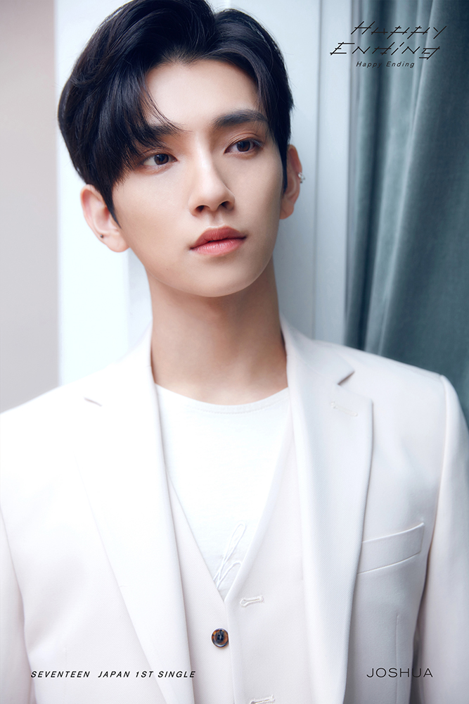
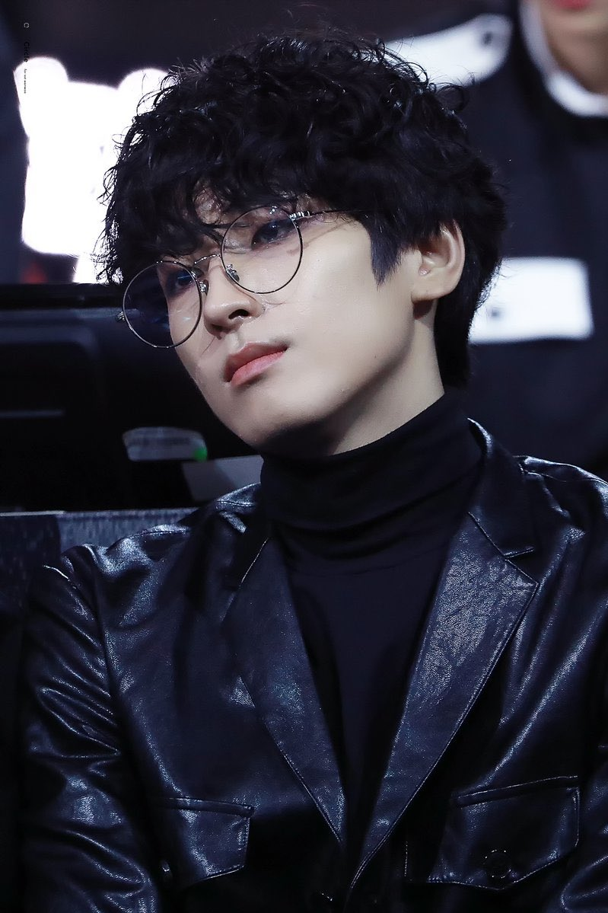
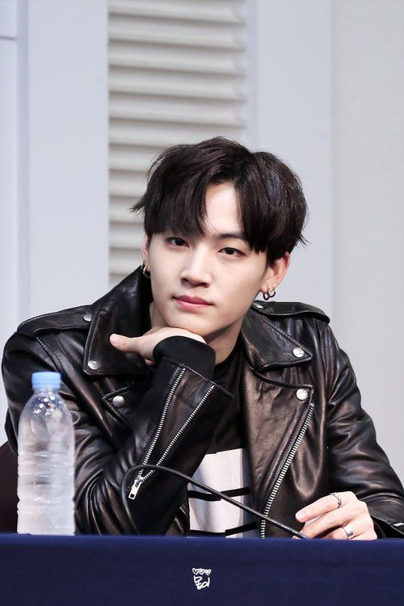
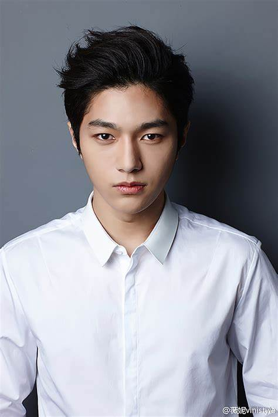
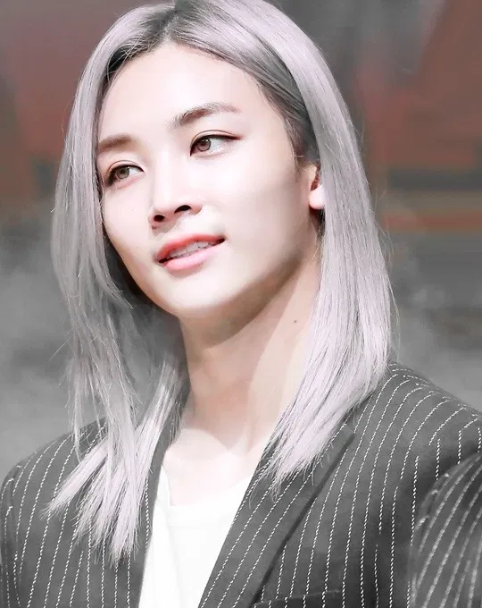
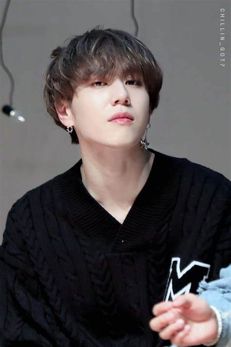

# PAROXCISM
### Sung-ho (Luhan Ex-EXO)

Sung-ho: the visual. soft image, a pretty boy with pastel mint blue hair and gentle features. His concept is to be elegant and princely, but he tends to be clumsy with dancing. was supposed to join B:ENT as a solo artist, but later debuted as a part of PAROXCISM due to his impressive vocals that support the other members well. He may seem delicate, but he has a lot of mental strength, and he takes criticism well. He cares well for Daesung.
He wants to buy a limited edition Banana Republic monogram tuxedo shirt, but it's expensive. is running out of his favorite perfume. doesn't go on the V live channel enough to chat with ROXIES. his acting is not anywhere near the level he wants it to be. wondering what hair color will be next for him in their next comeback. Worried about the condition of his hair being bleached again.
Acoustic, classical, electronic, jazz. His current favorite artists are Junsu (k-acoustic), Sungha Jung (k-acoustic) and Thomas Ades (classical). His recommended song is Take Me To Church by Hozier, because he likes the pro LGBTQ message it promotes. His favorite lyrics are, "She tells me "worship in the bedroom, The only heaven I'll be sent to, Is when I'm alone with you."
A classy person. someone who dresses elegantly and speaks formally. Someone who does well at events, so that he can take them as his date. People who appreciate good quality coffee appeal to him. He likes to read, so he'd like to be with someone who enjoys it too. His ideal date would be afternoon tea, followed by a show at the theater. They can hold hands during the musical and he will walk them home after.
Throws knives at a dartboard with great accuracy. When Sung-ho was a child, he had a dream that he would go and join the circus. Because of that, he begged his parents to send him to a school where he could learn how to handle knives— he was convinced that if he didn’t know how to throw them, he’d be the person being thrown knives at in the circus.
Initially auditioned to be a solo artist, thinking it would be easy. Though he'd passed the auditions, Sung-ho suffered heavily during life as a trainee, and almost quit twice to go back to his rich family that raised him preciously. At his lowest point, Daesung comforted him as a dongsaeng, despite the fact that they weren't close. He signed the contract because he thought he had a good voice, but stayed because he thought he found a family. He actually asked to debut in a group with the other 4 members.
Father and mother, 1 older stepsister. is only close to his mother (who divorced his father), and does not speak to his older step sister or father at all. he transfers money directly to his mother's account so that his father or stepsister will not have access to the money. he often stays with his mother whenever the members are given breaks, or takes her on short trips overseas for fun.

### Taemin (Joshua Seventeen)

Taemin: PAROXCISM's beloved, brunette and petite leader who spits fire as easily as he breathes. he is the shortest member out of the rest, and they always tease him for it but the other members truly do respect him and cherish him. respectful and mature, he has the best makings to assume the leadership role within the group despite him being younger than Sung-ho. he is very close to Ki-moon even though they have polar opposite personalities.
Trying to keep Ki-moon from going on Twitter so often. worrying about
Daesung injured himself while out riding his BMX. he hasn't had time to watch the last few episodes of Goblin, even though he really wants to. It's hard to write good songs for his mixtape. has been missing his dog lately and wishes they could keep one as a group. misses his grandparents and wants to go see them.
Pop, acoustic, hiphop, rock, oldies. His current favorite artists are Hello Venus (k-pop), Simon Dominic (k-hiphop), and The Eagles (rock/oldies). His recommended song is Sleeping Child by Michael Learns to Rock because it's his mother's favorite song. His favorite lyrics are, "If all the people around the world had a mind like yours, We'd have no fighting and no wars, there would be lasting peace on Earth."
He thinks people who can carry off a natural air are really cute. when girls wear oversized sweaters he likes it, and also when they wear sneakers. he'd like someone who appreciates PAROXCISM's songs! it's important to him that his friends and his significant other get along well. his ideal date is for them to go out shopping and he can buy presents for his partner, and after that they can go home together and share earphones.
Is amazing at making things with origami. His mother owned an ikebana school, so he was very influenced with Japanese culture from a young age. origami was something his mother taught him to keep him busy as a child, and he loves it very much. He is capable of folding things as simple as a flower or a heart up to things like dinosaurs and rhinos.
Was scouted by Namjoon, who later built the group around him. Taemin was the key figure, and he was initially reluctant because of a lack of self confidence. However, he was built up by Ki-moon, who was the first trainee out of the 5 that eventually debuted, and he began to gain his footing as they grew closer. Namjoon played a big part in the reason why Taemin chose to stay; especially because he invested a special amount of time fostering leadership skills in him and telling him he could really make it.
Grandmother and grandfather, only child. his mother passed away giving birth to him, and his father committed suicide shortly after. he's lived a happy life, and he loves his grandparents dearly. he sends them food often, along with long handwritten letters, and calls them as often as he can. he doesn't have dongsaengs, which is why he dotes a lot on the maknae twins in the group. 

### Ki-Moon (Wonwoo Seventeen)

Ki-moon: resident lead dancer, who's quiet, stoic and reserved. He actually hates being in the spotlight unless he's on stage and dancing, and finds it awkward otherwise. In terms of mental fortitude, he has the most— it's because he has the policy of doing all that he can and then letting the chips fall where they may; it's easy for him to ignore criticism if it isn't constructive. He's the closest to Taemin and looks after the maknae twins well.
He drinks too many caffeinated drinks and gets scolded by Taemin. Missing one of his favorite Snapple bottle caps that he collects. it's hard to take in hurtful comments by antis on the internet. His vocal lessons are hard. doesn't know what "#JWOI" means. wants to learn how to build a bookshelf so they have one in the dorm. He wants to have a long chat with JHope but hasn't had the time.
Indie, acoustic, hiphop, electronic and soul. His current favorite artists are Gramatik (electronic), 1TYM (k-hiphop), and Lauren Acquilina (indie/soul). His recommended song is King by Lauren Acquilina because it gives him the strength to continue working hard. His favorite lyrics are, "You've got it all, You lost your mind in the sound, There's so much more, You can reclaim your crown, You're in control, Rid of the monsters inside your head, Put all your faults to bed, You can be king again."
Wants to be with someone laid back. Has to be a little more talkative than him, and appreciate the same music he does. He thinks girls who like to sleep a lot are cute, but they also have to be diligent when it's necessary. prefers someone who plays an instrument. His ideal date would be staying at home so that he can cook with her, and then playing a song for her in the living room after they've finished eating.
Card magic. he trained himself to be a street musician in the past because he was good at it in middle school, and he wanted to increase his confidence in speaking with people and busking earned him money. Ki-moon is particularly good with card magic, and he can do tricks with pretty much any household item. His best trick is the ‘This’n’That’ card trick.
The first trainee out of the 5 that eventually debuted. He originally went to B:ENT under the impression that he'd be a producer, which was why it came as a shock when Namjoon decided to include him to the trainee list. Ki-moon took it all in calmly, and he conceded his pride in order to pursue his dreams. He wasn't as good at vocals, but he was good at dancing even though he had no background. He decided to stay due to his friendship with Taemin, and the way Hoseok genuinely cared for him as a hyung.
Father, younger brother. His mother passed away when he was about 8 years old in a tragic car accident. His father suffered from depression for many years, and his dongsaeng - who was only 2 - actually calls him appa for how he raised his younger brother. Ki-moon cares well for his family, and sends about 60% of his money back to them every month. he is funding his brother's schooling  

### Daesung (Sungmin Super Junior)

Daesung: less confident even though he is the older brother, he is susceptible to getting overly affected by harsh criticism. He is easily hurt and insecure, even though he struggles just as hard, or even twice as hard. His biggest insecurity is being compared to his twin brother and constantly falling short. He is the closest to his brother, even though they bicker often. He also tends to be the mood maker with Daehyun whenever PAROXCISM is gathered.
Worried that other members are much better at doing things than him.
concerned about Ki-moon overworking himself in the studio again. Wonders if he visits the fancafe enough and answers enough questions for ROXIES. Wondering if their comeback will be successful. missing his parents and his grandmother very much. Has sudden mood swings once in a while.
Hiphop, pop, EDM, electronic. his current favorite artists are Garion (k-hiphop), The Temper Trap (indie), and Avicii (electronic/EDM). his recommended song is The Nights by Avicii, because the song reminds him of his own father's advice to him. his favorite lyrics are, "He said, "One day you'll leave this world behind, So live a life you will remember. My father told me when I was just a child, These are the nights that never die."
Likes girls who enjoy the same hobbies! which means anime, sports and music. a dancer would be nice. he thinks girls who wear jeans and bomber jackets are cool. likes girls who experiment a lot with their hairstyle. adventurous girls who like to explore new places appeal to him. his ideal date would be going out for activities like rock climbing or hiking, and then they could have a picnic out in the open.
Bartending tricks. even though they’re underage, the twins’ parents own a bar in Busan, and Daesung had always been interested in his father’s amazing bartending flourishes. He can juggle up to 4 bottles, and he practices this when his ILGI or PAROXCISM hyungs want to drink. he’s capable of recreating professional cocktails after reading a recipe only once.
Imitates anime characters well. he can act out full scenes at a time, especially from the anime he really loves. Daehyun loves all different genres, so he’ll even do robotic sound effects if he’s imitating a character from a mecha anime, and he’ll also do all the SFX if he’s reenacting a scene from a shoujo anime. he loves psychological and comedy genres.
The last and youngest trainees of ALL the trainees in B:ENT. they were hyper and excitable, which made training them very difficult. Their attention would wander often. These two were scolded the most in their trainee days, but they decided to stay because of the way B:ENT cared for their artists as a company and a family. Both of them agreed that if they were not happy in 5 years, they would do something else, but they wanted to give this life a shot together as brothers.
Mother and father, no other siblings. they were raised preciously, and well loved. the twins both call their parents frequently, and they also text with their parents often in a family group chat. they wanted to send money back like the other hyungs, but their parents told them to practice saving it instead, since they were working. they send food items from Seoul instead  

### Daehyun (Sanduel B1A4)

Daehyun: strong-willed. he understands and knows his hyungs very well; he's also particularly careful in watching his slightly ditzy older brother and being mindful of his mood swings. an observant kid, he is conscious of what to say in order to brighten up the situation and is usually the mood maker of the group. he is protective of his hyungs and worries for them even while they are apart for only a short while, especially his twin brother.
Trying to keep Daesung's spirits up. making sure the other hyungs are not suffering. Conflicted between waiting for Joon-ki and Ki-ha to have a free day so they can watch anime together, or if he should just watch it first. Wonders if there will be more ENTRIES at their next fan meet. wants the comeback to do so well they're invited for Kcon. Needs to keep up his abs for fans.
Rock, hiphop, electronic, indie. his current favorite artists are Drunken Tiger (k-hiphop), The Glitch Mob (electrionic), FT Island (k-rock), and Owl City (electronic). his recommended song is Vanilla Twilight by Owl City, because it reminds him of his hyungs. his favorite lyrics are, "I'll watch the night turn light blue, But it's not the same without you, Because it takes two to whisper quietly."
Thinks girls who are smart are the coolest. appreciates when girls speak their mind and are straightforward with what they want. prefers girls who smile a lot and wants his partner to have a pretty laugh. likes tomboyish girls. it's important for her to get along with his twin brother. his ideal date is to go for a movie and dinner; it's simple but classic. then he'll walk the girl home and kiss her on her doorstep.
The last and youngest trainees of ALL the trainees in B:ENT. they were hyper and excitable, which made training them very difficult. Their attention would wander often. these two were scolded the most in their trainee days, but they decided to stay because of the way B:ENT cared for their artists as a company and a family. both of them agreed that if they were not happy in 5 years, they would do something else, but they wanted to give this life a shot together as brothers.
Mother and father, no other siblings. they were raised preciously, and well loved. the twins both call their parents frequently, and they also text with their parents often in a family group chat. they wanted to send money back like the other hyungs, but their parents told them to practice saving it instead, since they were working. they send food items from Seoul instead.  

# ILGI
### Seojun (Jaebum GOT7)

He's a hardworking guy and suited to being a leader. even though he's generally mature, he tends to get rowdy if all the members are gathered. he makes it a point to know and compliment the other members well, and looks out for Ki-ha the most because he's the maknae. he had a hard time in the past accepting his role as ILGI's leader because he didn't like shouldering that responsibility but has grown to fill his shoes after extended tutelage under Yoongi and continued encouragements from their fans. kind of shy; he's actually an introverted guy who doesn't tend to do well with strangers. he has an intimidating first impression on others. Seojun used to rap with Cheolmin sporadically in the underground scene.
Is literally incapable of figuring out how PayPal works. Wondering if he goes on the fan cafe enough. doesn't know what to say whenever Cheolmin fucking starts a V-live randomly, which is all the goddamn time. hasn't really had time to find more new music and wants to listen to some. doesn't understand why ENTRIES keep saying members of their band are disrespectful on the internet.
Likes most genres, from EDM to hiphop to acoustic. enjoys instrumental music a lot. his current favorite artists are IU (acoustic), Fox Stevenson (EDM and electronic), and Nell (k-rock/indie). his recommended song is Shelter by Porter Robinson and Madeon, because he misses his father and he likes the message of fatherly love for his child in the animated MV. His favorite lyrics are, "And it's a long way forward, so trust in me. I'll give them shelter as you've done for me."
Girls who like the same music he does. he likes girls who have long hair and wears street style clothes. he doesn't mind if she's the same height as him but would prefer for her to be slightly shorter. he thinks girls who can eat a lot are cute and prefers for them to have a healthy appetite. his ideal date is a simple dinner in a small restaurant where they can talk and learn about each other over a few hours and beers.
Can open bottles of soda or beer with basically anything— his teeth, a lighter, the thong of a slipper… he usually drinks with Yoongi, Joon-ki or Taeming, and they’ve all encouraged him to pursue this as his personal talent. He’s capable of looking around a room and seeing 10 things with which he can open a bottle instantly— he finds it weird that it’s instinctive.
He was scouted specifically by Yoongi from the underground. Yoongi went to 3 separate shows and 4 rap battle stages before he decided to take Seojun in. he had been scouted before and turned down all offers because he knew about the rift between the underground and the idol industry, but Yoongi didn't bring him in immediately. Instead, Yoongi befriended Seojun over meals and drinks and after four months, Seojun decided to sign with the company upon seeing Yoongi's genuine love for music and his passion.
mother, father, 1 younger brother. close to his parents, and will call back every Monday, Wednesday and Friday. his dongsaeng is studying in Seoul, and they meet whenever Seojun can take a break from his activities with ILGI, usually by Han River. Seojun is warm towards his family and treasures them a lot. he always sends money back to his parents every month.  

### Joon-ki (Myungsoo INFINITE)
  
An argumentative and problematic guy; he's sharp-tongued and blunt. Joon-ki likes to think he's the type not to care about anything, but he's actually very caring even though he hides it. he's fiercely protective of the other members- Cheolmin in particular. though he's quick to argue, he's also quick to step down and apologize if proven wrong. he speaks his mind and usually lets his emotions get the better of him, but he's actually a good and respectful kid once you get past his attitude problems to bond with him. is the closest to Seojun. he's a bit of a tsundere, and he secretly enjoys listening to music by BLACKPINK and AOA through his earphones at night.
He wants to learn how to ride a bike but he has no time. is stressed about keeping up with One Piece because of their hectic schedule. worried about starting a conversation with Whasa from MAMAMOO next time because he thinks she's cool. wondering how to start his own mukbang show and whether he can do it well. can't find the left sock for one of his favorite pairs of socks.
Rock, hiphop, pop. likes to work out to heavy bass music. his current favorite artists are Mamamoo (k-pop), Cherry Filter (k-rock), and Mikky Ekko (alternative rock). his recommended song is Who Are You Really by Mikky Ekko, because the song is about self-discovery, and taking control of your own life. his favorite lyrics are, "We are the fire, we see how they run. See how they run, lift me higher, let me look at the sun."
He liked people with a lot of attitude. short hair appeals to him, and those with bold styles intrigue him a lot. he thinks someone who can pull of leather jackets are cool. He's especially attracted to rappers like himself. he thinks he should date someone who knows how to cook. his ideal date is going to a concert, where they can hold hands and cheer on a band that they like together.
Can dislocate his shoulder and pop it back in anytime. because Jook-ki is an athletic guy, he used to play many sports, from basketball to soccer and even badminton. During a volleyball competition in middle school, Joon-ki dislocated his shoulder mid-match but continued playing without realizing it. he’s now capable of doing this without breaking a sweat.
Watched Seojun rapping in the underground and found him and his style of rap admirable. he went for B:ENT auditions thinking that he would be fine as long as he could stand on the same stage as his leader, but he ran into many problems because of his stubborn attitude and coarse language; he also did not have a good relationship with Cheolmin. with hesitation, he only decided to sign the contract 2 weeks before Yoongi officially debuted the group, but he is happy with the group now.
mother, 1 younger sister. used to fight with his mother a lot, but cares for her deeply now that he's older; she divorced his father because he used to beat her. he calls her every weekend. his younger sister is a tomboy and a bassist in a band back in Daegu, and she usually travels up to Seoul once a month to meet him. they get along fairly well, even though they tend to bicker a lot.  

### Cheolmin (Jeonghan Seventeen)

 ILGI's visual; he's the prettiest artist under B:ENT's management, even though ILGI is a hip hop group with no real need for idol visual standards. he's confident and his mental strength is really no joke. Cheolmin bickers often with Joon-ki because their perspectives differ so much. he really likes Ki-ha and does everything to make him happy. although he looks delicate, he's also the biggest shade-thrower in ILGI, and he doesn't hesitate to shut people down when he's not happy with something. used to rap with Seojun in the underground scene, but was not as famous or well-respected as the leader. he is the only member to be considered extroverted and friendly.
Wondering if his legs can trend like his nose bridge did. the lyrics for his solo song are hard to write. wants to go to a spa soon because his complexion is worrying. Reading a lot of hateful comments about himself on Twitter is hard to take in. is keen on learning how to make his own cologne, but doesn't have the time. wonders if glass beads are in or out this season.
Loves indie, pop, rock, and electronic music, country. his current favorite artists are Hyukoh (k-indie), Dir En Grey (j-rock), and Noosa (electronica). His recommended song is Walk on By by Noosa (the Sound Remedy remix) because he relates well to the lyrics. His favorite lyrics are, "You're showing me colors of the sky, But all I see is gray, You lost me when you lied. I don't ever wanna be crowned, Just another prize, It breaks my heart."
Hasn't elaborated much on his ideal type, but more on the qualities they should have. he wants his future lover to be kind and generous with themselves and towards others. they have to be meticulous about their appearance, because Cheolmin himself is, and he likes an elegant style. he prefers people who like to read. his ideal date would be a picnic and then stargazing, so that he can show his partner his favorite constellations.
Can do a wide variety of bird whistles, and actually manages to call birds towards him. His father was an avid bird watcher, and taught him everything he knows about birds. he’s also capable of reeling off facts any most birds, even the rare ones that no one’s ever heard of. there was a time a bird perched on his head for more than 8 hours while he was in high school.
He, like Seojun, was scouted. Yoongi went for 2 separate shows and 11 battles, because Cheolmin was often challenged in the underground due to his appearances, but he always won. it was the easiest to recruit Cheolmin; he took the entire process in stride and his mindset was, 'I should pursue my music in the way life presents me.' he signed the contract 2 days after he met Yoongi, and he continued with B:ENT as a trainee. he did not complain or whine; Cheolmin adapted well to the life of a trainee.
Mother, father, 1 younger sister. he is not close to his parents at all, and their relationship is poor, but he gets along extremely well with his dongsaeng, who is a fashion major. she studies in an arts school in Seoul, and they often meet up whenever they can. even though Cheolmin doesn't speak to his parents, he does send them money... much to his sister's disapproval.  

### Ki-Ha (Yugyeom GOT7)

A cute kid with a lot of heart; he's quiet and doesn't talk very much. he's easily flustered, but you wouldn't think it because he has a dark brooding stare and likes wearing dark urban clothing. he worries a lot about his hyungs- especially Joon-ki, whose temper is legendary even amongst other idols. Ki-ha's goal for 2017 is to make more friends so that he can have someone to play with when the company gives them breaks. he's a good and well-mannered guy with a lot of nerves, but he flares up on stage with charisma. from time to time, Ki-ha accidentally calls Yoongi "abeoji" because he left home when he was very young to join Bulletproof Entertainment as a trainee.
He wants to make more celebrity friends so he has people to play with when B:ENT give them breaks, but is too quiet to start a conversation first. wonders if he talks to ENTRIES enough. wonders if an acoustic collaboration with Ki-moon is possible. Worried he isn't working out enough. misses tennis and wants to play soon. Wonder when he will have the time to go visit his parents.
Acoustic, hiphop, electronic and indie, classical, jazz. his current favorite artists are Vanilla Acoustic (k-acoustic), The XX (indie/pop), and Chet Baker (jazz/blues). His recommended song is It's Always You by Chet Baker, because it reminds him of his feelings towards ENTRIES. his favorite lyrics are, "If a breeze caresses me, It's really you strolling by, If I hear a melody, It's merely the way you sigh."
People who are quiet and introverted, but secretly have a lot to say and talk about. he liked people who have a sense of dry humor. prefers his significant other to dress modestly. he thinks glasses are cute, and likes when they have to adjust them further up on their nose. his ideal date would be a dinner at a classy restaurant followed by a long walk, so that they can talk more.
Has deadly accuracy when shooting with rubber bands. was close with the boys in his neighborhood as a child, and they used to fight often. because of this, they would play games with rubber bands to see who had to give in to who. as a result, he’s now good enough with shooting a rubber band that he’s eve
Auditioned in Ilsan and got in. he had gone for other auditions, and had been offered placements by 4 other companies, all of them bigger than B:ENT. the reason Ki-ha decided to join B:ENT was because he was a big fan of Agust D, and when he heard that he could have an opportunity to train under the tutelage of a legend, he decided to go for the audition. it was an easy decision for him to go into B:ENT, because of Yoongi's presence as a producer there. he, too, adapted well to the life of a trainee.
Mother, father. only child, but has a lot of cousins. he is close to his parents even though he doesn't talk to them often (usually once a month or maybe even less). he buys souvenirs for all his little cousins when he goes to special places and sends them via post with cards and notes. he sends money back to his parents diligently and dedicates his success to them often in speeches and on TV.